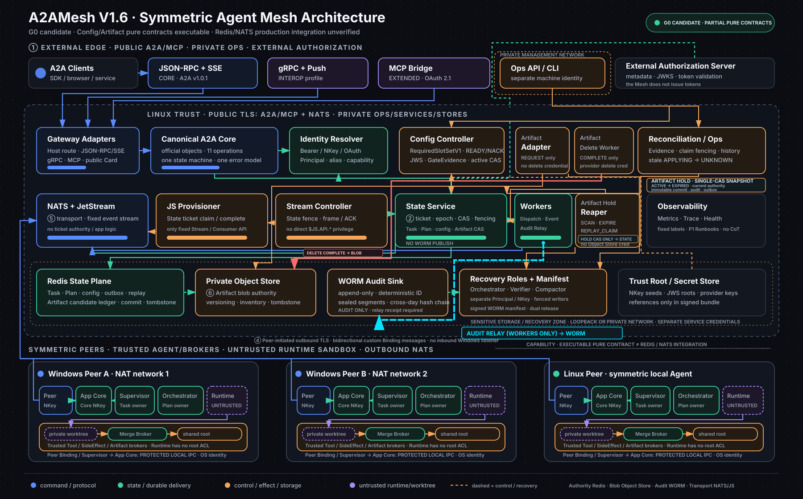

# A2AMesh

对称 Agent Mesh：一台公网 Linux 与多台 NAT 后 Windows/Linux Peer 通过 NATS 互联，任意 Agent 都可调用任意 Agent；公网 Gateway 负责标准协议适配，但不是固定主 Agent 或 Mesh Leader。

> **当前实现状态：** private A2A-inspired NATS RPC prototype。V1.6/V1.2 是当前 G0 候选集，独立复审修复正在关闭；Canonical Core、Redis State、官方 A2A 黑盒、三机故障注入和生产门禁均未完成。不得据此声明已兼容 A2A v1 或已生产可用。

## 最新架构

[](docs/assets/A2AMesh_V1.6_Architecture.html)

- [交互式架构图](docs/assets/A2AMesh_V1.6_Architecture.html)
- [SVG 架构图](docs/assets/A2AMesh_V1.6_Architecture.svg)
- [最新架构全量分析 V1.6](docs/specs/A2AMesh_最新架构全量分析_V1.6.md)
- [当前权威设计索引](docs/specs/README.md)
- [开发实施计划](docs/specs/A2AMesh_开发实施计划.md)

### 架构说明

- **对称调用：** Linux 和两个 NAT 后 Windows Peer 都是执行节点；Peer-to-Peer 东西向调用直接走 NATS，不必经过 Gateway。
- **公开协议面：** `CORE` 目标提供 A2A JSON-RPC/SSE；`INTEROP` 累积增加 gRPC/Push；`EXTENDED` 在 INTEROP 之上累积增加 MCP/OAuth/Observer。
- **Canonical Core：** 所有 Binding 复用官方 A2A 对象、11 个操作、状态机、错误和幂等语义，不允许各自实现第二套业务规则。
- **命令可靠性：** State `claim_message` 原子创建 SUBMITTED Task、immutable command、QUEUED admission、event outbox 和 blocked dispatch；持久 DRR 选中后，Worker 用私有 `DispatchTask` 投递，Peer 通过单一 accept/start CAS 进入 WORKING。
- **状态权威：** Redis State Service 管理 Task/Card/Principal/dedupe/lease/dispatch/outbox/effect/Plan/admission/config/reconciliation/audit/recovery 热状态；Peer 和 Projector 不反向覆盖权威快照。
- **事件可靠性：** Event Relay 多实例使用 claim lease；同一 Task 只发布 head event，收到 JetStream PubAck 后才完成 outbox。
- **取消语义：** Redis `cancelRequested` 是持久事实；NATS control Subject 只降低延迟，丢失后 Supervisor heartbeat/接管仍会观察取消。
- **副作用安全：** effectIntent/effectAttempt 分离；陈旧 `APPLYING` 自动转 `UNKNOWN` 并创建唯一人工对账 case。
- **Runtime 边界：** 只有通过签名 ContainmentProfile、OS 隔离、私有 attempt worktree、受 fence Merge Broker、egress/tool broker 和 launch attestation 的 `MEDIATED` Runtime 才能进入自动副作用路径。
- **Artifact：** blob 只进入私有 Object Store；稳定 URI 为 `a2amesh://artifacts/<artifactId>`，signed URL 仅短期传输且不持久化。
- **受信配置：** RFC 8785 + JWS 签名 bundle、一次性 genesis、可信 READY 和单 active generation；变更和启动 fail closed。
- **审计与恢复：** Audit Relay 投递独立 append-only/WORM Sink；Redis、JetStream、Object Store、config、audit 由共同 Recovery Manifest 判定恢复成功。
- **V1 边界：** 单 Mesh、单信任域、单公网 Linux SPOF；不建设 tenant、RBAC、Permission Center 或跨区域 HA。

## 交付剖面

| 剖面 | 目标能力 | 宣称门禁 |
|---|---|---|
| `CORE` | Canonical Core、Redis State、NATS Binding、JSON-RPC/SSE、长任务、Config/Artifact/Reconciliation/Audit | C0～C5（含 C2.5）+ C7/C8 CORE + 官方 JSON-RPC 黑盒 + Linux/1 NAT Peer |
| `INTEROP` | CORE + gRPC + Push + 额外 Runtime | CORE + C6-I + C7/C8 INTEROP + 官方 gRPC stub/三机矩阵 |
| `EXTENDED` | INTEROP + MCP/OAuth + Observer | INTEROP + C6-E + C7/C8 EXTENDED + MCP/OAuth/Observer 黑盒 |

当前三个剖面均未完成发布门禁。

## 当前代码与目标设计

| 已有迁移输入 | 仍需完成 |
|---|---|
| 私有 Pydantic AgentCard/Task/Message | 官方 A2A v1 对象与 Canonical Core |
| 私有 NATS request/reply | versioned NATS Binding、durable dispatch、ordered Event Relay |
| Runtime/Adapter/Orchestrator 原型 | Supervisor、Plan State、DRR、workspace fencing、containment |
| Identity/AuthContext 原语 | Redis Credential/Alias/replay 权威和多实例验证 |
| MCP Client/有限 Server Bridge 原型 | Core/State dedupe、OAuth Resource Server 和官方黑盒 |

## 快速开始（当前私有原型）

以下命令仅用于当前原型开发，不代表标准 A2A V1 部署：

```bash
uv sync
uv run a2amesh init --name win1 --nats tls://<公网主机>:4222
uv run a2amesh bootstrap
# 将 bootstrap 输出的 public key 交给 NATS 管理员写入 nats.conf，
# 配置 TLS/NKey permission 后先启动并验证 NATS Server。
uv run a2amesh agent start --config agents.yaml
uv run mesh list
uv run mesh call win2 "执行 dir 并报告"
```

正式 V1 的依赖锁定、部署和兼容门禁以[开发实施计划](docs/specs/A2AMesh_开发实施计划.md)为准。

## 目录

- `src/a2amesh/` —— 当前核心库与迁移输入
- `nats/` —— NATS 配置
- `docs/specs/` —— 当前权威设计与实施计划
- `docs/assets/` —— 最新架构图
- `docs/archive/` —— 已替代、不可作为当前合同的历史文档
