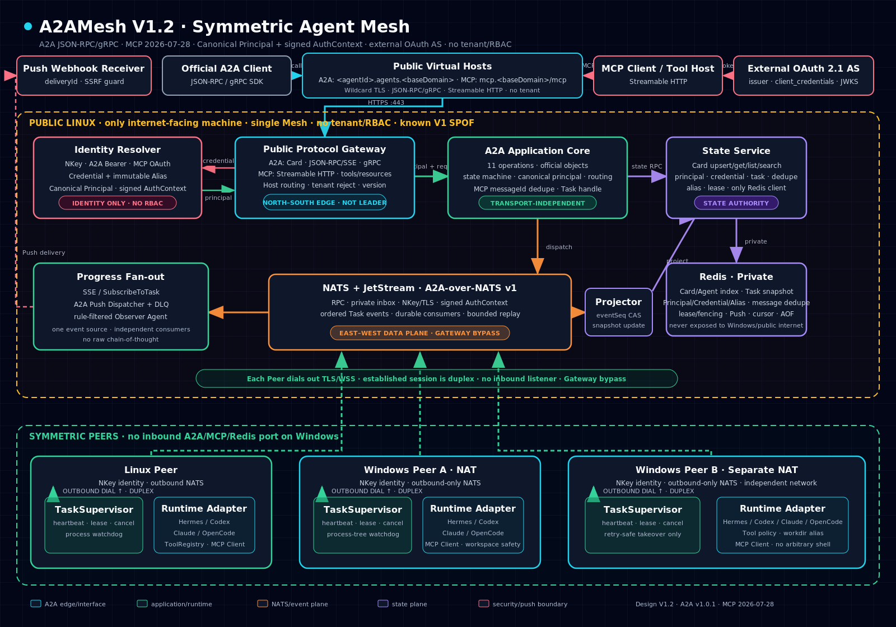

# A2AMesh

对称 Agent Mesh：多台异构机器的 AI Agent（Hermes / Codex / OpenCode / Claude Code）经公网 NATS 互联，任意 agent 可调度任意 agent，NAT 友好。

> **兼容性状态：** 当前代码是 A2A-inspired 的私有 NATS RPC 原型，尚未通过官方黑盒验证。目标是完整实现 A2A v1.0 Agent Card、11 个操作、JSON-RPC/SSE、gRPC，以及 MCP 2026-07-28 Client/Server Bridge。

最新可实施设计入口见 [A2AMesh V1.2 设计文档索引](docs/specs/README.md)，包含 8 份当前专项文档及 1 份开发实施计划；V1.0/V1.1 作为不可变历史版本保留。

## 最新架构



- **南北向：** 官方 A2A Client 经每 Agent 通配子域名使用 JSON-RPC/SSE 或 gRPC；MCP Client 经独立 Streamable HTTP Bridge；
- **东西向：** Linux/Windows Peer 直接经 NATS v1 Binding 对称调用，不经过 Gateway；
- **状态面：** State Service 独占私有 Redis，管理 Card、Agent 查询、Task、幂等、lease 和 Push；
- **长任务：** TaskSupervisor → JetStream → Redis Projector / SSE / Push / Observer；
- **MCP：** Peer 消费配置的 stdio/Streamable HTTP Server；公网 Linux 只暴露白名单 Mesh tools/resources；
- **身份：** NKey、A2A Bearer、MCP OAuth 经 Identity Resolver 统一为 Canonical Principal，内部 AuthContext 使用 NKey 签名；
- **幂等：** MCP `mesh_submit_task` 强制稳定 messageId，与 A2A 共用 Redis claim/dedupe；
- **OAuth：** 外部 Authorization Server + RFC 9728/RFC 8414 + client_credentials/JWKS，故障 fail closed；
- **边界：** Gateway 不是 Mesh Leader 或固定调度主节点，V1 不建设 tenant/RBAC。

[查看可缩放 SVG](docs/assets/A2AMesh_V1.2_Architecture.svg) · [查看自包含 HTML](docs/assets/A2AMesh_V1.2_Architecture.html)

## 快速开始

```bash
pip install -e .
a2amesh init --name win1 --nats wss://<公网IP>:4222
a2amesh bootstrap
a2amesh agent start
mesh list
mesh call win2 "执行 dir 并报告"
```

## 目录

- `src/a2amesh/` —— 核心库
- `nats/` —— NATS 配置
- `docs/` —— 设计文档
- `skills/` —— mesh skill（让 Hermes 当协调者）
