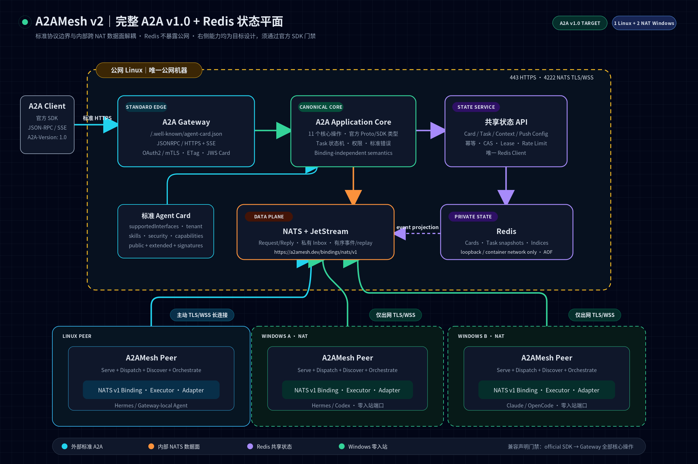

# A2AMesh v2：A2A v1.0 + Redis 状态平面设计

> **文档性质：目标架构与迁移规范，不代表当前代码已经实现。** 只有通过本文末尾的官方 SDK 黑盒门禁后，项目才可宣称“A2A v1.0 兼容”。
>
> 规范基线：A2A Specification release **v1.0.1**；协议协商值使用 **`1.0`**（A2A 规范明确要求不使用 patch 号参与协商）。
>
> SDK 验证基线：`a2a-sdk==1.1.2`。内部 NATS Binding 是 A2AMesh 自定义绑定，不等于标准 JSON-RPC、gRPC 或 HTTP+JSON Binding。



可缩放源图：[SVG](A2A_V1_REDIS_ARCHITECTURE.svg) · [自包含 HTML](A2A_V1_REDIS_ARCHITECTURE.html)

---

## 1. 结论

A2AMesh 采用以下最终分工：

| 层 | 组件 | 唯一职责 |
|---|---|---|
| 标准协议边界 | A2A Gateway | 发布标准 Agent Card；提供 A2A v1.0 JSON-RPC/HTTPS、SSE；鉴权并完成标准对象解析/序列化 |
| 应用语义 | A2A Application Core | 实现全部 A2A 核心操作、任务状态机、权限与错误语义；与任何传输解耦 |
| 跨 NAT 数据面 | NATS + JetStream | peer 主动出网连接；Request/Reply；私有 Reply Inbox；有序事件日志与重订阅 |
| 共享状态平面 | State Service + Redis | Agent Card 索引、presence、Task/Context 快照、幂等、分页、租约、Push 配置、限流 |
| 执行面 | Linux/Windows A2AMesh Peer | 将标准 A2A 请求映射到 Hermes/Codex/Claude/OpenCode；产生标准 Task/Message/Artifact/事件 |

关键约束：

1. **Redis 不替代 NATS。** Redis 不承载 peer 间实时 RPC，也不直接暴露给 NAT 后的 Windows。
2. **NATS 不替代标准 A2A 接口。** 外部官方 A2A 客户端通过 HTTPS/SSE 调用 Gateway。
3. **Redis 只由公网 Linux 上的 State Service 访问。** Redis 绑定 loopback 或容器私网，不开放公网端口。
4. **官方 Proto/SDK 是协议对象的唯一事实源。** 项目不再手工维护“看起来像 A2A”的平行模型。
5. **兼容性按接口声明。** Agent Card 只声明已经通过一致性测试的 `supportedInterfaces`。

---

## 2. 为什么当前项目看起来没有 Agent Card 等 A2A 功能

当前代码不是完全没有 Agent Card，而是只有一个**私有、简化、不可与 A2A v1 互操作的卡片模型**。

| 能力 | 当前证据 | 判断 |
|---|---|---|
| `AgentCard` Python 类 | `src/a2amesh/contracts/models.py` | 有，但只有 `name/description/capabilities/skills`，不是 v1 完整模型 |
| Agent Card JSON Schema | `src/a2amesh/schemas/agent-card.json` | 有，但缺少 `supportedInterfaces/version/securityRequirements/defaultInputModes/...` |
| 私有卡片查询 | `a2anats/server.py` 订阅 `a2a.cards.<agent>`；`client.py#get_card` | 有，仅 A2AMesh NATS 客户端可用 |
| 私有发现 | NATS `$SRV.PING` + 逐个拉卡片 | 有，不是标准公共发现 URI |
| 标准发现 | `GET /.well-known/agent-card.json` | **缺失**；当前没有 `src/a2amesh/gateway/` 实现 |
| 标准 A2A 对外 Binding | JSON-RPC/HTTPS、SSE、HTTP+JSON 或 gRPC | **缺失** |
| 规范模型 | 官方 `Task/Message/Part/Artifact/StreamResponse` | **不兼容**；当前字段明显简化 |
| v1 方法 | `SendMessage`、`ListTasks`、`SubscribeToTask` 等 | **缺失或使用旧版名称** |
| 官方 SDK 一致性测试 | 官方 client → 本项目 server | **缺失**；默认环境未安装 `a2a-sdk` |

因此当前准确表述是：

> **A2AMesh 当前实现是 A2A-inspired 的私有 NATS RPC 原型，支持部分旧版 A2A 概念，但尚不是 A2A v1.0 兼容实现。**

造成“没有 A2A 功能”的主要原因：

- 设计先解决了跨 NAT 调用，所以优先实现 NATS 数据面；
- 把旧版 v0.3 风格方法名与自定义对象误当成“完整 A2A”；
- Gateway/HTTP/SSE 只存在于旧设计文档，代码目录实际不存在；
- Agent Card 只有内部注册用途，没有标准发现、接口声明、安全声明、缓存和签名；
- 任务只存本进程内存，无法支持标准 `ListTasks`、重启恢复、多副本、重订阅和完整 Push 配置。

---

## 3. “完全兼容 A2A”的验收定义

### 3.1 版本

- 规范发布版本：A2A v1.0.1。
- 线上协商值：`A2A-Version: 1.0`。
- Agent Card `supportedInterfaces[].protocolVersion`：`"1.0"`。
- 不在同一个处理器中混用 v0.3 的小写方法和 v1 的 PascalCase 方法。
- 若未来保留 v0.3，只能作为单独 URL/Adapter，且卡片中单独声明该接口。

### 3.2 必须实现的 11 个核心操作

| # | 抽象操作 / JSON-RPC v1 方法 | 目标行为 |
|---|---|---|
| 1 | `SendMessage` | 返回 `Task` 或直接 `Message`；支持 blocking/`returnImmediately` |
| 2 | `SendStreamingMessage` | SSE 首帧为 `Task` 或单一 `Message`；随后发送标准状态/工件事件 |
| 3 | `GetTask` | 按调用者/租户鉴权读取 Task；支持 `historyLength` |
| 4 | `ListTasks` | 过滤、倒序、游标分页；`nextPageToken/pageSize/totalSize` 语义正确 |
| 5 | `CancelTask` | 幂等取消并返回更新后的 `Task`；真正终止本地进程 |
| 6 | `SubscribeToTask` | 首帧必须是当前 `Task`；随后有序事件；终态关闭 |
| 7 | `CreateTaskPushNotificationConfig` | 持久化 webhook 配置并安全投递 |
| 8 | `GetTaskPushNotificationConfig` | 仅任务所有者/授权主体可读取 |
| 9 | `ListTaskPushNotificationConfigs` | 分页列出授权配置 |
| 10 | `DeleteTaskPushNotificationConfig` | 幂等删除，停止后续投递 |
| 11 | `GetExtendedAgentCard` | 鉴权后返回扩展卡片；按受众选择性披露 |

此外必须发布标准公共 Agent Card：

```text
GET https://<agent-domain>/.well-known/agent-card.json
```

旧设计中的 `/.well-known/agent.json` 必须删除或仅做 301 兼容跳转，不能作为规范路径。

### 3.3 必须使用的标准对象

项目协议边界直接使用官方 SDK/Proto 生成类型：

- `AgentCard`、`AgentInterface`、`AgentCapabilities`、`AgentSkill`；
- `Task`、`TaskStatus`、完整 `TaskState`；
- `Message`、`Part`、`Artifact`；
- `SendMessageRequest/Response`、`StreamResponse`；
- `TaskStatusUpdateEvent`、`TaskArtifactUpdateEvent`；
- Push Notification 与全部标准错误对象。

禁止继续把以下简化对象直接暴露为 A2A v1：

- 无 `messageId` 的 Message；
- 客户端生成新建 Task 的 `taskId`；
- 只有 `kind/text` 的自定义 Part；
- `task-id`、`message-update`、`final` 等非 v1 标准流事件；
- 只含 `submitted/working/completed/...` 且缺少 `rejected/auth-required` 的状态枚举；
- 把 `tools/call` 冒充 A2A 核心方法。

`tools/call` 若保留，必须作为命名空间扩展，或者更推荐将远程能力映射成 Agent Skill，由标准 `SendMessage` 调用。

---

## 4. 目标架构

```text
                         ┌───────────────────────────────────────────┐
Official A2A Client ───▶ │ Public A2A Gateway (Linux, HTTPS :443)    │
 JSON-RPC / SSE           │ - /.well-known/agent-card.json           │
 A2A-Version: 1.0         │ - JSONRPC Binding + SSE                  │
                         │ - auth / tenant / official SDK types      │
                         └──────────────┬────────────────────────────┘
                                        │ canonical A2A operations
                          ┌─────────────▼─────────────┐
                          │ A2A Application Core      │
                          │ state machine / policy /  │
                          │ error + binding mapping   │
                          └───────┬───────────┬───────┘
                                  │           │
                  state RPC       │           │ A2A-over-NATS v1
                                  │           │
                 ┌────────────────▼──┐   ┌────▼──────────────────────┐
                 │ State Service     │   │ NATS + JetStream          │
                 │ only Redis client │   │ TLS/NKey/ACL, public WSS  │
                 └────────┬──────────┘   └────┬─────────┬────────────┘
                          │ loopback/private   │         │
                 ┌────────▼──────────┐      outbound  outbound
                 │ Redis             │        │         │
                 │ cards/tasks/index │   ┌────▼───┐ ┌───▼────┐
                 │ idempotency/lease │   │Win Peer│ │Win Peer│
                 └───────────────────┘   │Hermes… │ │Codex…  │
                                        └────────┘ └────────┘
```

公网暴露面：

| 端口 | 对象 | 说明 |
|---|---|---|
| `443/tcp` | A2A Gateway | 标准 Agent Card、JSON-RPC/SSE；OAuth2/mTLS |
| `4222/tcp` 或 WSS | NATS | NAT 后 peer 主动连接；TLS + 每 peer NKey/ACL |
| `6379/tcp` | Redis | **禁止公网暴露**；仅 loopback/容器网络允许 State Service 访问 |

一台公网 Linux 仍是唯一公网机器，但包含三个进程：Gateway、NATS、State Service/Redis。Windows 仍然零入站。

---

## 5. Agent Card 设计

### 5.1 每个 Agent 都有标准卡片

- `mesh.example.com/.well-known/agent-card.json`：Mesh Orchestrator 的公共卡片。
- `win1.agents.mesh.example.com/.well-known/agent-card.json`：win1 的标准公共卡片。
- `win2.agents.mesh.example.com/.well-known/agent-card.json`：win2 的标准公共卡片。
- 使用 wildcard DNS/TLS 将所有子域路由到同一个 Gateway。
- 若没有域名，开发环境可以使用直接配置或 curated registry；生产标准发现需要 HTTPS 域名。

多 agent 共用一个 Gateway 时，每张卡的首选接口可以使用 v1 `tenant`：

```json
{
  "name": "win1-coding-agent",
  "description": "Windows coding agent backed by Hermes/Codex",
  "supportedInterfaces": [
    {
      "url": "https://mesh.example.com/a2a/v1",
      "protocolBinding": "JSONRPC",
      "tenant": "win1",
      "protocolVersion": "1.0"
    },
    {
      "url": "nats+wss://mesh.example.com/a2a.v1.rpc/win1",
      "protocolBinding": "https://a2amesh.dev/bindings/nats/v1",
      "tenant": "win1",
      "protocolVersion": "1.0"
    }
  ],
  "version": "1.0.0",
  "capabilities": {
    "streaming": true,
    "pushNotifications": true,
    "extendedAgentCard": true
  },
  "securitySchemes": {
    "meshOidc": {
      "openIdConnectSecurityScheme": {
        "openIdConnectUrl": "https://auth.example.com/.well-known/openid-configuration"
      }
    }
  },
  "securityRequirements": [
    {"schemes": {"meshOidc": {"list": ["a2a.invoke"]}}}
  ],
  "defaultInputModes": ["text/plain", "application/json"],
  "defaultOutputModes": ["text/plain", "application/json"],
  "skills": [
    {
      "id": "coding-task",
      "name": "Coding Task",
      "description": "Inspect, modify and test code within the authorized workspace.",
      "tags": ["coding", "testing", "repository"],
      "examples": ["修复测试失败并返回补丁和测试结果"],
      "inputModes": ["text/plain"],
      "outputModes": ["text/plain", "application/json"]
    }
  ]
}
```

说明：

- 上例字段必须由官方 SDK/ProtoJSON 序列化，不能手写另一份项目 Schema 作为规范源。
- NATS 接口只在受信任的内部/扩展卡片中展示；公共互联网客户端只需看到标准接口。
- runtime、workdir、工具风险、NATS subject 等属于 A2AMesh 扩展/内部路由元数据，不能替代标准 capabilities。
- 公共卡只披露低敏感度 skills；完整工具清单在 `GetExtendedAgentCard` 鉴权后返回。

### 5.2 缓存、版本与签名

- Redis 保存规范化 JSON 和 SHA-256 ETag。
- HTTP 返回 `Cache-Control: public, max-age=60` 与 `ETag`；支持 `If-None-Match → 304`。
- `AgentCard.version` 只在能力或接口发生变化时更新，不随 heartbeat 抖动。
- presence 与卡片分离；Agent 离线不改标准 Card 内容。
- 生产卡片使用 RFC 8785 JCS 规范化，并按 RFC 7515 JWS 签名；`signatures` 不参与签名本体。
- 密钥轮换期允许多签名；Redis 不保存签名私钥。

---

## 6. NATS 自定义 Binding

### 6.1 身份

- Binding URI：`https://a2amesh.dev/bindings/nats/v1`。
- A2A 协议版本：`1.0`。
- Binding 版本与 A2A 版本分开演进。
- JSON 使用 ProtoJSON camelCase；时间为 UTC ISO 8601；枚举按官方 ProtoJSON。

### 6.2 Subject

| Subject | 作用 |
|---|---|
| `a2a.v1.rpc.<tenant>.<agent>` | 目标 Agent 的全部核心操作入口，queue group 保证单副本执行 |
| `_INBOX.<caller>.<random>` | 调用方私有 unary/stream 回复通道 |
| `a2a.v1.events.<tenant>.<taskId>` | JetStream 内部有序事件日志；只允许 Gateway/State Projector 读取 |
| `a2a.v1.control.<tenant>.<agent>.<instance>` | cancel、lease-loss、drain 等实例控制 |
| `mesh.state.v1.*` | peer 到 State Service 的状态 RPC；不暴露 Redis |
| `a2a.v1.dlq.<tenant>.<agent>` | 运维死信，不属于 A2A 协议对象 |

### 6.3 Envelope

```json
{
  "binding": "https://a2amesh.dev/bindings/nats/v1",
  "protocolVersion": "1.0",
  "operation": "SendMessage",
  "requestId": "req-uuid",
  "serviceParameters": {
    "a2a-request-id": "traceable-id",
    "traceparent": "00-..."
  },
  "payload": {
    "tenant": "win1",
    "message": {
      "messageId": "msg-uuid",
      "role": "ROLE_USER",
      "parts": [{"text": "run tests", "mediaType": "text/plain"}]
    }
  }
}
```

流式消息额外带单调递增 `sequence`，其 `payload` 必须是标准 `StreamResponse`。终止条件由标准 Task 终态决定，不再发明 `final` 字段。

### 6.4 语义一致性

同一逻辑请求经 JSON-RPC 与 NATS Binding 必须产生等价：

- Task/Message/Artifact；
- Task ID、Context ID 与状态迁移；
- 事件顺序；
- A2A 错误类型；
- 鉴权与租户隔离；
- Push Notification 行为。

---

## 7. Redis 状态平面

### 7.1 为什么引入 Redis

当前 `_tasks`、`_task_fingerprints`、`_cancels` 均为进程内字典，导致：

- Agent/Gateway 重启后 `GetTask` 失效；
- 多副本不能共享任务和幂等结果；
- `ListTasks` 无法实现标准过滤、排序和游标分页；
- Agent Card 不能按 skill/tag/binding 查询；
- Push 配置、租约、限流无共享存储；
- 请求超时重试仍可能在另一实例重复执行。

Redis 提供低延迟共享状态与原子脚本，正好补齐这些控制/状态能力。

### 7.2 访问拓扑

Windows peer **不直连 Redis**：

```text
peer ──NATS mesh.state.v1.*──▶ State Service ──loopback──▶ Redis
```

好处：

- Redis 不暴露公网；
- 认证统一复用 NATS 身份；
- State Service 强制 tenant/principal；
- Redis key 结构和迁移不泄漏给 peer；
- 将来可把 Redis 替换为其他数据库而不改 Agent Binding。

### 7.3 Key Schema（不依赖 RedisJSON）

以下 `{tenant}` 是 Redis hash tag，保证单租户原子 Lua 操作位于同一 slot。当前三机规模使用单 Redis/AOF；未来大规模按 tenant 分片。

| Key | 类型 | 内容 / TTL |
|---|---|---|
| `a2am:v1:{tenant}:card:<agent>:public` | STRING | 官方 ProtoJSON；无短 TTL |
| `a2am:v1:{tenant}:card:<agent>:extended` | STRING | 扩展卡模板；应用层加密敏感字段 |
| `a2am:v1:{tenant}:card:<agent>:meta` | HASH | `version, etag, updatedMs, generation` |
| `a2am:v1:{tenant}:agents:presence` | ZSET | member=agent；score=lastSeenMs |
| `a2am:v1:{tenant}:idx:skill:<tag>` | SET | 支持该 tag 的 agent IDs |
| `a2am:v1:{tenant}:idx:binding:<binding>` | SET | 支持某 binding 的 agent IDs |
| `a2am:v1:{tenant}:task:<taskId>` | HASH | `taskJson,state,contextId,ownerAgent,ownerInstance,caller,createdMs,updatedMs,version,eventSeq` |
| `a2am:v1:{tenant}:tasks:updated` | ZSET | Task 按更新时间倒序分页 |
| `a2am:v1:{tenant}:tasks:state:<state>` | ZSET | 状态过滤索引 |
| `a2am:v1:{tenant}:context:<contextId>:tasks` | ZSET | Context 内 Task 索引 |
| `a2am:v1:{tenant}:dedupe:<caller>:<agent>:<messageId>` | HASH | `payloadHash,taskId`；TTL=Task 保留期 |
| `a2am:v1:{tenant}:lease:task:<taskId>` | STRING | owner instance + fencing token；`PX` 续租 |
| `a2am:v1:{tenant}:task:<taskId>:pushcfg` | SET | Push config IDs |
| `a2am:v1:{tenant}:pushcfg:<taskId>:<configId>` | HASH | URL、tokenHash、加密凭据、状态、重试计数 |
| `a2am:v1:{tenant}:rate:<principal>:<operation>` | HASH/ZSET | token bucket/sliding window |
| `a2am:v1:{tenant}:cursor:<opaque>` | STRING | 可选短期游标状态，推荐签名无状态游标 |

### 7.4 原子操作

State Service 必须使用 Lua 或 Redis Function 实现：

1. `claim_message(caller, agent, messageId, payloadHash)`
   - 不存在：服务器生成 `taskId`，写 dedupe + `TASK_STATE_SUBMITTED`；
   - 同 hash：返回原 taskId，不重复执行；
   - 不同 hash：返回 InvalidArgument；
   - 修正当前“客户端传 taskId 创建新任务”的 v1 违规行为。

2. `transition_task(taskId, expectedVersion, fromStates, toState, taskJson, eventSeq)`
   - 校验 CAS version 与合法状态迁移；
   - 更新 Task、状态索引、更新时间索引；
   - 返回新 version；
   - 防止 completed 后又被 late cancel 覆盖。

3. `acquire_lease(taskId, instance, ttl)` / `renew_lease(..., fencingToken)`
   - 每个 Task 同时只有一个执行 owner；
   - 所有写操作携带 fencing token，过期 owner 不能回写。

4. `upsert_card(agent, generation, cardJson, etag, indices)`
   - generation 单调递增；
   - 原子替换 skill/binding 索引；
   - heartbeat 只更新 presence，不重写卡片。

5. `consume_rate_token(principal, operation)`
   - 原子 token bucket；
   - 返回剩余额度和 retry-after。

### 7.5 Redis 与 JetStream 的边界

| 数据 | Redis | JetStream |
|---|---|---|
| 最新 Task 快照 | ✅ | 可选事件重建 |
| Task 状态/时间索引与分页 | ✅ | ❌ |
| Agent Card 与检索索引 | ✅ | Card-change 事件 |
| presence | ✅ ZSET | heartbeat 可作为输入 |
| 幂等映射 / lease / rate limit | ✅ | ❌ |
| 流式事件顺序与短期 replay | 仅保存 `eventSeq` | ✅ 权威事件日志 |
| 大 Artifact 二进制 | ❌ | Object Store / 外部对象存储 |
| Agent 间实时 RPC | ❌ | ✅ Core NATS Request/Reply |
| 长期审计 | ❌（只做热数据） | 外部日志/对象存储 |

不使用 Redis Pub/Sub 承载 A2A 流，因为它没有离线重放；不同时用 Redis Streams 和 JetStream 保存同一权威事件，避免双日志一致性问题。

---

## 8. 标准 Task 生命周期

```text
TASK_STATE_SUBMITTED
        │ executor acquires lease
        ▼
TASK_STATE_WORKING
  ├──▶ TASK_STATE_INPUT_REQUIRED ──new Message──▶ WORKING
  ├──▶ TASK_STATE_AUTH_REQUIRED  ──auth/input───▶ WORKING
  ├──▶ TASK_STATE_COMPLETED
  ├──▶ TASK_STATE_FAILED
  ├──▶ TASK_STATE_CANCELED
  └──▶ TASK_STATE_REJECTED
```

规则：

- 新 Task ID 由服务端生成。
- `contextId` 由服务端生成或校验客户端已有值；`taskId/contextId` 不匹配必须拒绝。
- 每次状态更新包含 UTC timestamp。
- completed/failed/canceled/rejected 为终态，禁止继续 SendMessage。
- `CancelTask` 先以 CAS 标记 cancel-requested（内部状态），再向 owner instance 发送控制消息；只有子进程实际终止后才落 `TASK_STATE_CANCELED`。
- Runtime 子进程在 Linux 和 Windows 都必须按进程组/Job Object 清理。
- Task 可配置热保留期（建议 7 天）；过期转冷存储后按标准 not-found/retention policy 行为处理。

---

## 9. Streaming、重订阅与 Push

### 9.1 SendStreamingMessage

1. Gateway 解析官方 `SendMessageRequest`。
2. Redis 原子 claim，并立即获得服务端 taskId。
3. 首帧发送当前 `Task`。
4. Peer 将标准 `TaskStatusUpdateEvent` / `TaskArtifactUpdateEvent` 写 JetStream。
5. Gateway 按 sequence 转 SSE；不得重排。
6. 终态事件后关闭流。

### 9.2 SubscribeToTask

1. Redis 鉴权并返回当前 Task + `eventSeq`。
2. Gateway **先发送 Task 首帧**。
3. 从 JetStream `eventSeq + 1` 开始 replay，再切 live tail。
4. 每个订阅独立 consumer；关闭一个订阅不能影响其他订阅或任务。
5. 终态 Task 按规范返回 `UnsupportedOperationError`，客户端应改用 `GetTask`。

### 9.3 Push Notification

- 配置存 Redis，credentials 在应用层 envelope encryption；日志禁止记录明文 token。
- Webhook 创建时防 SSRF：仅 HTTPS；DNS 解析后拒绝 loopback、link-local、RFC1918、云 metadata 地址；重定向每跳重校验。
- 每个投递带唯一 delivery ID 和签名；重试使用指数退避 + jitter。
- 事件 payload 使用标准 `StreamResponse`。
- 删除配置幂等；任务终态后按保留策略清理。
- Push worker 消费 JetStream，不阻塞任务执行。

---

## 10. 协议边界与扩展

### 10.1 标准字段不承载内部危险路由

以下内容不得裸放公共 Agent Card 或任意 Message metadata：

- 任意绝对 `workdir`；
- shell 命令数组；
- NKey seed / Redis key / 内部 subject；
- 未经授权的工具清单；
- runtime 的提权开关。

运行时选择使用可选扩展：

```text
https://a2amesh.dev/extensions/runtime-selection/v1
```

扩展必须：

- 在 Agent Card `capabilities.extensions` 声明；
- 在 Message `extensions` 列出 URI；
- 有单独 JSON Schema；
- 服务端按调用者策略校验；
- 不理解扩展的标准客户端仍可使用默认 runtime。

### 10.2 Tool 设计

- 默认只把低风险、业务语义明确的能力建模为 `AgentSkill`。
- 直接远程 `tools/call` 不是 A2A v1 核心能力。
- 如必须保留，使用独立 extension URI，并实施 allowlist、JSON Schema、审批、workspace sandbox 和审计。

---

## 11. 安全与多租户

1. 外部：HTTPS + OAuth2/OIDC 或 mTLS；认证要求写入 Agent Card。
2. 内部：NATS TLS + 每 peer 独立 NKey/account；publish/subscribe 最小权限。
3. Redis：仅 loopback/容器私网；ACL 独立用户；AOF/备份加密；不保存 NKey seed。
4. 所有 Redis key 和 NATS subject 均包含可信 tenant；不能直接相信请求 payload 的 tenant。
5. Task 绑定 `tenant + caller principal`；未授权访问返回与不存在一致的错误，避免枚举。
6. Gateway 验证 `A2A-Version`；不支持版本返回 `VersionNotSupportedError`。
7. Artifact 限制 MIME、大小、总量；大文件使用签名 URL / Object Store，不塞 Redis。
8. Push webhook 执行 SSRF 防护、域名/IP 重绑定复验和 egress policy。
9. Agent Card 私钥放 OS secret store/HSM，不放 Redis、YAML 或 Git。

---

## 12. 故障与降级

| 故障 | 设计行为 |
|---|---|
| Redis 短暂不可用 | fail closed：停止接收新任务/注册；已运行任务继续产生 JetStream 事件；恢复后 projector 回放并更新快照 |
| NATS 不可用 | peer 自动重连；Gateway 返回 temporary unavailable；Redis 保留 Task；lease 到期进入恢复流程 |
| Peer 崩溃 | lease 到期；仅显式可重试且具有幂等保证的任务允许接管，否则标记 failed 并保留诊断信息 |
| Gateway 崩溃 | 另一个 Gateway 可从 Redis Task 快照 + JetStream eventSeq 恢复订阅 |
| State Service 多副本 | Redis Lua + fencing token 保证原子性；NATS queue group 避免重复处理 |
| Redis 数据丢失 | 从 AOF/备份恢复；JetStream 可重建有限窗口内 Task 事件，但不能替代完整备份 |
| 单公网 Linux 故障 | 当前三机部署的已知单点；生产 HA 需第二公网节点/托管 NATS+Redis，不得宣称单机 HA |

Redis MVP 配置：

- `appendonly yes`
- `appendfsync everysec`
- RDB 定期快照和异机加密备份
- `maxmemory-policy noeviction`（协议状态不能被静默逐出）
- 监控 latency、evicted_keys、used_memory、AOF rewrite、connected_clients

---

## 13. 包结构调整

```text
src/a2amesh/
├── protocol/
│   ├── types.py                  # 仅 re-export 官方 a2a-sdk/proto 类型
│   ├── application.py            # 11 个抽象操作
│   ├── errors.py                 # 标准 A2A 错误
│   ├── agent_card.py             # build/validate/sign/cache
│   └── extensions/
│       └── runtime_selection.py
├── bindings/
│   ├── jsonrpc_http.py           # 标准 JSON-RPC + SSE
│   ├── http_json.py              # 可选第二标准 Binding
│   ├── grpc.py                   # 可选第三标准 Binding
│   └── nats_v1.py                # 自定义 Binding
├── state/
│   ├── client.py                 # peer/gateway → State Service（NATS RPC）
│   ├── service.py
│   ├── redis_repository.py
│   ├── scripts/                  # Lua/Redis Functions
│   └── projector.py              # JetStream → Redis snapshot
├── runtime/
│   └── ...                       # Hermes/Codex/Claude/OpenCode adapters
└── gateway/
    ├── app.py
    ├── auth.py
    ├── a2a_routes.py
    └── push_dispatcher.py
```

迁移后：

- `contracts/models.py` 不再定义标准 A2A 对象；只保留内部 Plan/Tool 等模型。
- `schemas/agent-card.json/message.json/task.json/...` 不再手写作为规范；从官方 proto/SDK 生成或在测试中直接验证官方类型。
- 自定义扩展 Schema 留在 `schemas/extensions/`。

依赖建议：

```toml
[project.optional-dependencies]
a2a = [
  "a2a-sdk[http-server,signing,telemetry]==1.1.2",
  "redis[hiredis]==8.1.0",
]
```

最终版本应由 lockfile 固定；升级 SDK 时先跑完整 conformance suite。

---

## 14. 迁移阶段

| 阶段 | 工作 | 退出门禁 |
|---|---|---|
| C0 基线纠正 | 文档撤销“100%兼容”；锁定 v1.0；建立官方 fixture | CI 能解析官方 Agent Card/Task/Message fixture |
| C1 Canonical Core | 官方类型 + 11 操作接口 + 错误/状态机 | application 层与传输无关单测通过 |
| C2 Redis State | State Service、Card/Task/Context、幂等、ListTasks、lease | Redis 重启/双实例/重复消息测试通过 |
| C3 NATS v1 Binding | PascalCase 操作、ProtoJSON、私有 inbox、JetStream replay | 与 application 语义等价测试通过 |
| C4 Standard Gateway | well-known Card、JSON-RPC、SSE、A2A-Version | 官方 Python SDK send/get/list/cancel/stream/subscribe 全通 |
| C5 Push/Extended/Signed Card | Push CRUD、SSRF 防护、extended card、JWS | 安全测试与签名验证通过 |
| C6 Multi-binding | HTTP+JSON；按需要实现 gRPC | 每个已声明 interface 跑同一黑盒套件 |
| C7 真机 | Linux + 2 Windows NAT | 任意 peer 调度、重启恢复、断网重连、无 Windows 入站 |

在 C4 前只能称“private A2A-inspired NATS protocol”；C4 后可称“A2A v1.0 JSON-RPC compatible”；C5 完成后才达到本项目定义的“完整 A2A 功能覆盖”。

---

## 15. 强制一致性测试

### 15.1 官方客户端黑盒

用独立虚拟环境安装固定版官方 SDK，不能导入项目内部客户端：

```text
official a2a-sdk client
  → GET /.well-known/agent-card.json
  → SendMessage
  → SendStreamingMessage
  → GetTask / ListTasks
  → SubscribeToTask
  → CancelTask
  → Push config CRUD
  → GetExtendedAgentCard
```

### 15.2 必测失败场景

- 缺失/错误 `A2A-Version`；
- 非法 ProtoJSON、未知字段与非法 enum；
- 同 messageId 同 payload 重试只执行一次；同 messageId 不同 payload 拒绝；
- client 传不存在 taskId 创建任务时返回 TaskNotFound；
- `taskId/contextId` 不匹配；
- unauthorized 与 not-found 不泄漏资源存在性；
- 两副本 queue group 只执行一次；
- timeout 后重试不重复启动 CLI；
- streaming 首帧/顺序/终态关闭；
- SubscribeToTask 首帧 + 断线 replay；
- CancelTask 真正杀死 Windows/Linux 子进程；
- ListTasks 游标排序、historyLength、includeArtifacts；
- Push SSRF、重定向、DNS rebinding、签名和幂等删除；
- Agent Card ETag/304、JWS 正确与篡改失败；
- Redis/NATS/peer/Gateway 分别重启后的恢复。

### 15.3 声明门禁

README/文档中只有在以下条件全部满足时才能出现“兼容”：

- 规范版本与 SDK 版本固定；
- 官方 SDK 黑盒通过；
- 每个 advertised binding 都通过同一语义套件；
- secure NATS ACL + Redis 隔离测试通过；
- wheel/container 安装后仍包含所有扩展 schema 和配置；
- CI 保留可复现报告。

项目自带 client ↔ 项目自带 server 测试只能证明内部自洽，不能证明 A2A 兼容。

---

## 16. 官方依据

- A2A Specification：<https://a2a-protocol.org/latest/specification/>
- Agent Discovery：<https://a2a-protocol.org/latest/topics/agent-discovery/>
- Custom Protocol Bindings：<https://a2a-protocol.org/latest/topics/custom-protocol-bindings/>
- 官方仓库：<https://github.com/a2aproject/A2A>
- v1.0.1 release：<https://github.com/a2aproject/A2A/releases/tag/v1.0.1>
- Python SDK：<https://pypi.org/project/a2a-sdk/>

本文以官方 `specification/a2a.proto` 为规范对象事实源；文档示例或项目手写 Schema 不得覆盖 Proto 定义。
