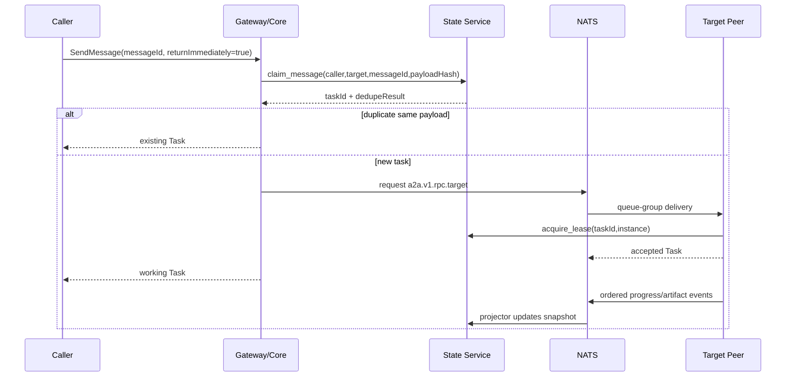

# A2AMesh A2A 协议与 NATS 集成适配设计 V1.2
> 文档ID：`A2AM-BIND-001`
> 文档状态：设计基线（待代码实现与验收）
> 权威范围：标准Gateway、NATS Binding、Subject与投递语义
> 目标读者：架构、Gateway、NATS、后端、测试、运维
> 评审状态：文档自检通过；Binding实现与真机验收待完成
> 最后更新：2026-08-14
> 适用产品版本：A2AMesh V1
> 协议基线：A2A v1.0.1（协商值 `1.0`）
> 维护者：A2AMesh 项目维护者
> 保密级别：公开项目文档
> 替代版本：V1.1
> 维护方式：版本化不可变文档；后续修订递增版本

---

# 1. 文档目的

本文档定义 A2AMesh 外部标准 A2A v1 JSON-RPC/gRPC Gateway 与内部 A2A-over-NATS 自定义 Binding 的职责边界、Subject、Envelope、操作映射、流式投递、发现、幂等、错误、连接恢复和部署规则。

A2A 规范对象以《Agent Card 与协议对象规范》为准；Redis 状态以《Redis 状态平面与数据设计》为准。NATS 解决 NAT 可达性和实时消息，不替代标准 HTTPS Binding，也不充当权威 Task 数据库。

## 1.1 版本说明

| 版本 | 日期 | 变更说明 |
|---|---|---|
| V1.0 | 2026-08-14 | 建立标准 Gateway、NATS v1 Binding、Subject、Envelope、11 操作映射和一致性门禁 |
| V1.1 | 2026-08-14 | 补齐对称旁路、State Agent/Card RPC、JSON-RPC/gRPC语义复用、官方错误和发现闭环 |
| V1.2 | 2026-08-14 | 补齐可信AuthContext、Canonical Principal传播与跨Binding幂等 |

---

# 2. 集成原则

1. 外部接口与内部 Binding 使用同一 Application Core 和官方对象。
2. NATS Binding URI 固定为：

```text
https://a2amesh.dev/bindings/nats/v1
```

3. NATS Binding 是项目自定义协议，不属于标准 `JSONRPC`、`GRPC` 或 `HTTP+JSON`。
4. Windows/Linux Peer 只主动连接 NATS；不要求 NAT 打洞或反向端口。
5. Request/Reply 使用私有 caller inbox；不能把输出发布到可预测公共 subject。
6. JetStream 保存有序 Task 事件；Core NATS request/reply 用于低延迟命令。
7. Redis 是 Task/Card 快照权威来源；NATS 消息不是数据库事实。
8. V1 单 Mesh，不在 subject/payload 引入 tenant；以配置 `mesh_id`、独立 NATS account 和凭据隔离部署。
9. 每个 advertised interface 必须通过同一语义测试。
10. Public Gateway 只处理外部标准 A2A 南北向流量；Peer A→Peer B 的东西向调用直接发布到目标 RPC Subject，不经过 Gateway，也不存在固定主调度节点。

---

# 3. 组件关系

```text
Official A2A Client
  │ HTTPS JSON-RPC/SSE or HTTP/2 gRPC
  ▼
Public Gateway
  │ official request/response/event
  ▼
Application Core
  ├── StateClient ─NATS RPC─▶ State Service ─▶ Redis
  └── NatsBindingClient ─────▶ NATS Server
                                ├▶ target Peer queue group
                                ├▶ private caller inbox
                                └▶ JetStream task events
```

| 组件 | 做什么 | 不做什么 |
|---|---|---|
| Gateway | JSON-RPC/gRPC 标准序列化、A2A-Version/metadata、SSE/stream | 不执行 Runtime |
| Core | 业务语义、状态机、路由、错误 | 不依赖 HTTP/NATS 细节 |
| NATS Binding | canonical object 与 subject/envelope 映射 | 不维护 Task 权威状态 |
| State Service | 幂等、lease、Task/Card 索引 | 不转发 stdout |
| Peer | Runtime 执行和事件产生 | 不直接访问 Redis |

---

# 4. 连接与身份

## 4.1 NATS 连接

生产连接要求：

- TLS 或 WSS；
- 每个 Peer/服务独立 NKey；
- 禁止共享 seed；
- seed 从 OS Secret Store/受保护文件加载；
- 自动重连、指数退避和 jitter；
- 连接名包含 `mesh_id/agent_id/instance_id`；
- 服务端启用 JetStream 持久目录与容量限制。

## 4.2 身份映射

NATS 服务端认证身份映射为：

```text
principal = nkey_public_key or configured account user
agent_id  = server-side credential mapping
instance_id = peer-generated UUID per process start
```

payload 中的 `callerAgentId` 仅用于诊断，State Service/Core 必须使用认证连接身份，不能相信调用方自报 ID。

## 4.3 ACL

示例最小权限：

| 身份 | Publish | Subscribe |
|---|---|---|
| Peer `agent-a` | 自身 RPC reply、events、state client request | `a2a.v1.rpc.agent-a`、自身 control、私有 inbox prefix |
| Gateway | 任意目标 RPC、state query、push control | Gateway 私有 inbox、task event consumer |
| State Service | state replies、card/task change event | `a2a.v1.state.>` |
| Observer | 无或受控 intervention request | 指定 task event durable consumer |

真实 ACL 必须在启用 JetStream 后做端到端验证；Core NATS ACL 成功不代表 Stream/KV 权限正确。

---

# 5. Subject 规范

| Subject | 类型 | 说明 |
|---|---|---|
| `a2a.v1.rpc.<agentId>` | Core request/reply | 目标 Agent 的 11 操作入口 |
| `a2a.v1.control.<agentId>.<instanceId>` | Core pub/sub | Cancel、shutdown、lease-lost 等实例控制 |
| `_INBOX.a2amesh.<callerId>.<random>` | Core reply | 调用方私有单次/流式回复 |
| `a2a.v1.events.<taskId>` | JetStream | 标准 Task 事件和内部序列元数据 |
| `a2a.v1.state.card.upsert` | Core request/reply | 注册/更新认证 Peer 的 Card |
| `a2a.v1.state.card.get` | Core request/reply | 按 agentId 读取 Card/meta/presence |
| `a2a.v1.state.agent.list` | Core request/reply | 稳定排序和游标分页列出 Agent |
| `a2a.v1.state.agent.search` | Core request/reply | 按 skill/binding/runtime/online/capacity 查询 |
| `a2a.v1.state.presence.heartbeat` | Core request/reply | 更新认证 Peer instance presence |
| `a2a.v1.state.agent.unregister` | Core request/reply | generation/tombstone 幂等退役 |
| `a2a.v1.state.principal.resolve` | Core request/reply | 验证 Credential/alias，返回 Canonical Principal |
| `a2a.v1.cards.changed` | JetStream/Core event | Card 变更提示，Card 内容仍从 State 查询 |
| `a2a.v1.presence.heartbeat` | Core event | Peer heartbeat 输入 |
| `a2a.v1.observer.intervention` | Core request | 经策略授权的观察者建议/操作请求 |

规则：

- `agentId`、`taskId` 只允许安全字符并在构造 subject 前校验；
- 不把 workdir、runtime 参数、用户文本放 subject；
- reply subject 必须使用不可预测随机 token；
- 目标 Peer 使用 queue group `a2a-worker-<agentId>`，同一请求只交给一个实例；
- Task 事件不允许任意 Peer 广播订阅，按 account/consumer 权限限制。

---

# 6. Binding Envelope

## 6.1 请求

```json
{
  "bindingVersion": "https://a2amesh.dev/bindings/nats/v1",
  "protocolVersion": "1.0",
  "operation": "SendMessage",
  "requestId": "req-01H...",
  "callerAgentId": "linux-gateway",
  "authContext": {
    "principalId": "a2a:cli-buildbot",
    "credentialId": "cli-buildbot",
    "method": "a2a-bearer",
    "issuer": "a2amesh-gateway",
    "subject": "cli-buildbot",
    "issuedAt": "2026-08-14T03:00:00Z",
    "expiresAt": "2026-08-14T03:05:00Z"
  },
  "authProof": {
    "signer": "gateway-service-nkey-public",
    "algorithm": "nkey-ed25519",
    "signature": "base64url-signature"
  },
  "targetAgentId": "windows-a",
  "sentAt": "2026-08-14T03:00:00Z",
  "deadlineAt": "2026-08-14T03:30:00Z",
  "replySubject": "_INBOX.a2amesh.linux-gateway.<random>",
  "payload": {
    "message": {
      "messageId": "msg-01H...",
      "role": "ROLE_USER",
      "parts": [{"text": "Run the repository tests."}]
    },
    "configuration": {"returnImmediately": true}
  }
}
```

`payload` 是对应官方 Request 的 ProtoJSON，不再嵌套旧版 JSON-RPC。

## 6.2 一次性响应

```json
{
  "bindingVersion": "https://a2amesh.dev/bindings/nats/v1",
  "protocolVersion": "1.0",
  "requestId": "req-01H...",
  "sequence": 1,
  "final": true,
  "payload": {
    "task": {
      "id": "task-01H...",
      "contextId": "ctx-01H...",
      "status": {
        "state": "TASK_STATE_WORKING",
        "timestamp": "2026-08-14T03:00:00Z"
      }
    }
  }
}
```

## 6.3 错误响应

```json
{
  "bindingVersion": "https://a2amesh.dev/bindings/nats/v1",
  "protocolVersion": "1.0",
  "requestId": "req-01H...",
  "sequence": 1,
  "final": true,
  "error": {
    "type": "TaskNotFoundError",
    "message": "Task was not found or is not accessible.",
    "retryable": false
  }
}
```

外部诊断必须脱敏；内部 Trace 通过 `requestId/taskId/traceId` 关联。

## 6.4 流式帧

每帧必须包含递增 `sequence`、同一 `requestId` 和单个 canonical `StreamResponse`。终态帧 `final=true`，之后禁止再发布。

## 6.5 可信 AuthContext

`callerAgentId` 只用于诊断，业务身份以验证后的 `authContext.principalId` 为准。AuthContext 不是外部 A2A 对象，由可信入口生成：

| 入口 | 原始凭据 | Principal 初值 | 签名者 |
|---|---|---|---|
| Peer 东西向 | NATS NKey | `agent:<agentId>` | Peer 自身 NKey |
| JSON-RPC/gRPC | 独立 opaque Bearer/credentialId | `a2a:<credentialId>` | Gateway service NKey |
| MCP Bridge | OAuth issuer + client_id | `mcp:<issuerHash>:<clientId>` | MCP Gateway service NKey |
| 内部服务 | service NKey | `system:<component>` | 组件 NKey |

入口调用 State `principal.resolve` 应用显式 alias 后，使用 RFC 8785 规范化 Envelope（排除 `authProof.signature`），再用 NKey Ed25519 签名。接收端验证 signer 是否有权代表该 method/subject、签名、issuedAt/expiresAt、requestId/deadline 和目标 Subject。任何失败在 claim/dispatch 前拒绝。

业务 payload、Message metadata 或 MCP arguments 中的 `callerPrincipal/authContext/credentialId` 均不可信，不得覆盖。外部 Token 不随 Envelope 转发；仅传不可逆 credentialId/issuerHash 和已签名 Principal。

---

# 7. 核心操作映射

JSON-RPC 与 gRPC 都把下列 11 个操作交给同一 Core。gRPC 使用官方 `A2AService`：`SendStreamingMessage` 与 `SubscribeToTask` 为 server-streaming；其余为 unary。任何 Binding 特有适配不得改变 Task ID、状态迁移、错误、幂等键、排序或终态规则。

| API ID | A2A v1 操作 | NATS operation | State/Peer |
|---|---|---|---|
| API-A2A-001 | SendMessage | `SendMessage` | Core claim + Peer execute |
| API-A2A-002 | SendStreamingMessage | `SendStreamingMessage` | Peer stream + Gateway SSE |
| API-A2A-003 | GetTask | `GetTask` | Redis 快照，不必访问 Peer |
| API-A2A-004 | ListTasks | `ListTasks` | Redis 索引/游标 |
| API-A2A-005 | CancelTask | `CancelTask` | Redis CAS + owner control |
| API-A2A-006 | SubscribeToTask | `SubscribeToTask` | Redis 首帧 + JetStream live |
| API-A2A-007 | CreateTaskPushNotificationConfig | 同名 | State + Push Dispatcher |
| API-A2A-008 | GetTaskPushNotificationConfig | 同名 | State |
| API-A2A-009 | ListTaskPushNotificationConfigs | 同名 | State |
| API-A2A-010 | DeleteTaskPushNotificationConfig | 同名 | State，幂等 |
| API-A2A-011 | GetExtendedAgentCard | 同名 | State/Card Service |

禁止混用 v0.3 `message/send`、`message/stream`、`tasks/get`、`tasks/resubscribe` 作为 v1 wire method。迁移期旧入口只能放在明确标记的 compatibility adapter 中，默认关闭。

---

# 8. SendMessage 流程



Core 在 dispatch timeout 后只允许使用同一 messageId 重试；Peer/State dedupe 必须保证不会启动第二个副作用执行。

---

# 9. Streaming 与订阅

## 9.1 SendStreamingMessage

1. Core 先 claim Task。
2. 首帧必须为 Task 或规范允许的 Message。
3. Peer 事件转 canonical `TaskStatusUpdateEvent`/`TaskArtifactUpdateEvent`。
4. Gateway 转 SSE，保持顺序。
5. 终态关闭。

## 9.2 SubscribeToTask

1. State 鉴权/归属校验并读取 Task 与内部 `eventSeq` 水位。
2. Gateway 建立 live consumer，发送当前 Task 首帧。
3. 服务端用水位消除“读快照到开始 live”之间的竞态。
4. 标准请求没有客户端 replay cursor；断线后客户端执行 `GetTask + SubscribeToTask`。
5. A2AMesh Progress Extension 可声明 `lastEventSequence` 进行私有补发，但不得称为标准能力。

## 9.3 多订阅者

- 每个订阅独立 consumer/私有 inbox；
- 关闭一个订阅不影响 Task；
- 不同订阅者收到相同生成顺序；
- 慢订阅者按队列上限断开并要求 GetTask 重连，不能拖住任务执行。

---

# 10. Agent Card 注册与发现

Peer 启动后调用 State Service：

```text
upsert_card(agentId, instanceId, generation, cardProtoJson, etag)
```

State Service：

- 使用认证连接映射 agentId；
- 官方 SDK 解析 Card；
- 校验自定义 NATS interface URL/Binding；
- 原子替换 skill/interface 索引；
- 发布 `cards.changed` 轻量事件；
- presence 单独更新。

NATS `$SRV.PING` 可用于服务运行诊断，但不能作为唯一 Agent Card registry；普通 `nc.request($SRV.PING)` 只得到一个 responder，枚举时必须 inbox + bounded collection。

## 10.1 State Service Agent/Card RPC

以下均为 **A2AMesh 内部操作**，不是 A2A v1 核心操作：

| Subject | 请求关键字段 | 响应 | 幂等/排序 |
|---|---|---|---|
| `a2a.v1.state.card.upsert` | `instanceId,generation,cardProtoJson,etag`；agentId 取认证身份 | `cardMeta,created` | agentId+generation；旧 generation 拒绝 |
| `a2a.v1.state.card.get` | `agentId,includeOffline` | `card,cardMeta,presence` | 只读 |
| `a2a.v1.state.agent.list` | `pageSize,pageToken,onlineOnly` | `agents,nextPageToken` | `agentId ASC`，最大 200 |
| `a2a.v1.state.agent.search` | `skillTags,bindingUri,runtime,onlineOnly,minAvailableCapacity,page*` | `agents,nextPageToken` | filtersHash 绑定游标；稳定 agentId 次序 |
| `a2a.v1.state.presence.heartbeat` | `instanceId,startedAt,runtimes,runningTasks,capacity` | `acceptedAt,presenceState` | agentId 取认证身份；同 instance 覆盖最新值 |
| `a2a.v1.state.agent.unregister` | `instanceId,generation,reason` | `tombstonedAt` | 重复调用返回同 tombstone |
| `a2a.v1.state.principal.resolve` | `authMethod,credentialId/issuer+subject,nkeyPublic` | `principalId,aliasGeneration` | 只读；结果由受信配置与 Credential Registry 决定 |

`card.get/list/search` 返回的 Agent 摘要至少包含 `agentId,name,version,skills,supportedInterfaces,online,lastSeenAt,instances,runtimes,availableCapacity`。Card 本体只由 `card.get` 返回；列表不复制完整 Card，避免大响应。查询游标、索引和 tombstone 的 Redis 契约见 `DATA-CARD-001`。

调用者不能在 heartbeat/upsert payload 中指定其他 agentId；State Service 使用 NATS 认证 principal 映射。Gateway 的 Host 路由先调用 `card.get`，Peer 编排发现优先调用 `agent.search`。

---

# 11. 投递语义与幂等

| 场景 | 保证 |
|---|---|
| Core request/reply | 至多一次收到响应不等于至多一次执行；依赖 State dedupe |
| JetStream event | 至少一次消费；consumer 按 taskId/eventSequence 去重 |
| Push webhook | 至少一次；按 deliveryId/eventSequence 去重 |
| Cancel | 幂等；重复 cancel 返回当前 Task |
| Card upsert | generation 幂等，旧 generation 拒绝 |
| State transition | task version + fencing token CAS |

任意自动重试必须同时满足：稳定 idempotency key、服务端 dedupe、payload hash 一致、任务策略允许重试。

---

# 12. 错误映射

| 内部情况 | A2A 错误 | 是否重试 |
|---|---|---|
| 版本不是 1.0 | `VersionNotSupportedError` | 否，协商后重试 |
| target Card 不存在 | 内部 `AgentNotFound`；外部系统错误/路由不可用 | 否 |
| target offline | HTTP 503 / gRPC `UNAVAILABLE` / JSON-RPC system error | 有限重试 |
| Message/字段非法 | Binding invalid request/invalid params | 否 |
| Task 不存在 | `TaskNotFoundError` | 否 |
| 终态取消 | `TaskNotCancelableError` | 否 |
| 未声明 Streaming | `UnsupportedOperationError` | 否 |
| Push 未启用 | `PushNotificationNotSupportedError` | 否 |
| NATS 超时 | 系统 unavailable，不伪造 A2A 专用错误 | 同 messageId 可重试 |
| Runtime 启动失败 | Task → FAILED | 按策略 |
| Redis 不可用 | 系统 unavailable，停止新提交 | 恢复后 |

错误响应不包含 subject、内部 IP、argv、栈、凭据和绝对路径。

---

# 13. 重连与故障

## 13.1 Peer 断线

- NATS 客户端自动重连；
- presence 进入 suspect/offline；
- 已运行任务 heartbeat/lease 过期；
- 只有 retry-safe 任务允许新实例接管；
- 旧实例恢复后因 fencing token 失效不能写状态。

## 13.2 NATS 重启

- JetStream 使用持久目录；
- Peer/Gateway 重连并重新订阅；
- Redis 保留 Task 快照；
- 事件窗口内由 Projector 重放；
- 无法确认的副作用任务不自动重新 dispatch。

## 13.3 Gateway 重启

Task 独立于 Gateway 连接继续执行。客户端重新 GetTask/Subscribe。Push Dispatcher 使用 durable consumer 恢复。

---

# 14. 配置基线

```yaml
mesh:
  id: default
nats:
  servers: ["tls://mesh.example.com:4222"]
  connect_timeout_seconds: 5
  reconnect_wait_seconds: 2
  max_reconnect_attempts: -1
  inbox_prefix: "_INBOX.a2amesh"
  jetstream:
    stream: "A2A_TASK_EVENTS"
    subjects: ["a2a.v1.events.*"]
    max_age_hours: 24
binding:
  uri: "https://a2amesh.dev/bindings/nats/v1"
  protocol_version: "1.0"
```

凭据不写 YAML，使用环境变量指向 secret 文件或 OS Secret Store。

---

# 15. 验收用例

- **TEST-MESH-001**：Linux 与两台 Windows 仅主动连接 NATS，任意方向 RPC 成功且 Peer 东西向调用不经过 Gateway。
- **TEST-A2A-001**：每个操作的 NATS payload 可由官方对象解析，JSON-RPC/gRPC/NATS advertised Binding 通过同一语义套件。
- **TEST-GRPC-001**：官方 stub 的 unary/server-streaming、deadline/cancel、metadata 和 gRPC status 映射通过。
- **TEST-SEC-001**：私有 inbox/Task event ACL 阻止其他 Peer 订阅；伪造 agentId 无效。
- **TEST-IDEMP-001**：queue group 双实例和 timeout 重试只启动一次执行。
- **TEST-STREAM-001**：多订阅者事件顺序一致，终态后无多余帧；标准订阅不依赖 replay cursor。
- **TEST-REGISTRY-001**：upsert/get/list/search/heartbeat/unregister 的认证、分页、排序、generation 和 tombstone 正确。
- **TEST-IDENTITY-001**：三类入口签名、过期/重放/伪造 caller、alias generation 与 Principal 传播正确。
- **TEST-TENANT-001**：NATS Envelope 不含 tenant；官方 payload 非空 tenant 在签名/dispatch 前拒绝。
- **TEST-RECOVERY-001**：NATS/Peer/Gateway 分别重启后 Task 快照与终态一致。
---

# 16. 参考依据

- [A2AMesh V1 设计文档索引](README.md)
- [业务与总体架构设计 V1.2](A2AMesh_业务与总体架构设计_V1.2.md)
- [AgentCard与协议对象规范 V1.2](A2AMesh_AgentCard与协议对象规范_V1.2.md)
- [Redis状态平面与数据设计 V1.2](A2AMesh_Redis状态平面与数据设计_V1.2.md)
- [任务生命周期与长任务运行时设计 V1.2](A2AMesh_任务生命周期与长任务运行时设计_V1.2.md)
- [编排器 Runtime与工具适配设计 V1.2](A2AMesh_编排器_Runtime与工具适配设计_V1.2.md)
- [接口请求与响应标准 V1.2](A2AMesh_接口请求与响应标准_V1.2.md)
- [统计审计与运行监控规则 V1.2](A2AMesh_统计审计与运行监控规则_V1.2.md)
- [A2A Specification v1.0.1 Release](https://github.com/a2aproject/A2A/releases/tag/v1.0.1)
- [A2A v1.0.1 canonical Proto](https://github.com/a2aproject/A2A/blob/v1.0.1/specification/a2a.proto)
- [A2A Agent Discovery](https://a2a-protocol.org/latest/topics/agent-discovery/)
- [A2A Custom Protocol Bindings](https://a2a-protocol.org/latest/topics/custom-protocol-bindings/)
