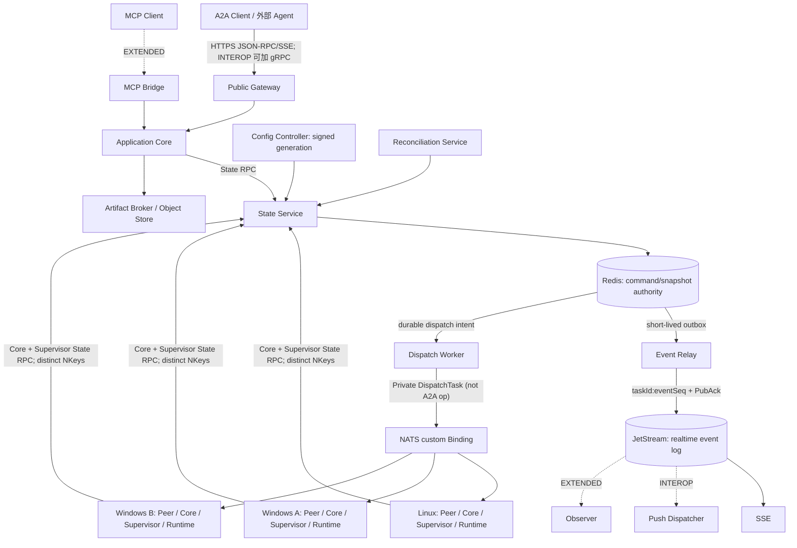

# A2AMesh 业务与总体架构设计 V1.6
> 文档ID：`A2AM-ARCH-001`
> 文档状态：设计基线（待代码实现与验收）
> 权威范围：A2AMesh总体范围、组件职责、部署拓扑与NFR
> 目标读者：产品、架构、后端、Runtime、测试、运维
> 评审状态：G0 候选自检完成；首轮独立复审问题已纳入修复，关闭复审待完成；代码、故障注入与交付剖面验收未完成
> 最后更新：2026-08-14
> 替代版本：V1.5；旧版位于 `docs/archive/v1.5/`，不得作为当前实现合同
> 适用产品版本：A2AMesh V1
> 协议基线：A2A v1.0.1（协商值 `1.0`）
> 维护者：A2AMesh 项目维护者
> 保密级别：公开项目文档
> 维护方式：版本化不可变文档；后续修订递增版本

---

## 1. 文档目的

本文档定义 A2AMesh 的产品定位、建设背景、能力边界、核心对象、总体架构、部署拓扑、V1 范围和验收目标，作为协议、数据、运行时、接口、监控和实施计划的上位规范。

A2AMesh 面向一台公网 Linux 与多台仅能主动出网的 Windows/Linux 机器，把 Hermes、Codex、Claude Code、OpenCode 等本地 Agent Runtime 组织成对称可发现、可调用、可观察的 Agent Mesh。外部通过标准 A2A v1 接口互操作，内部通过 NATS 自定义 Binding 穿越 NAT，Redis 提供共享状态。

详细对象见《Agent Card 与协议对象规范》，传输见《A2A 协议与 NATS 集成适配设计》，数据见《Redis 状态平面与数据设计》。大型 Artifact、受信配置生命周期和人工对账分别以对应专项文档为唯一权威；当前完成度见《开发实施计划》。

### 1.1 版本说明

| 版本 | 日期 | 变更说明 |
|---|---|---|
| V1.0 | 2026-08-14 | 按知识中心文档规范建立 A2AMesh 业务边界、总体架构、V1 范围和验收目标 |
| V1.1 | 2026-08-14 | 冻结Gateway非主节点、每Agent路由、JSON-RPC/gRPC双Binding、MCP双向桥和追踪闭环 |
| V1.2 | 2026-08-14 | 闭合Canonical Principal、MCP提交幂等、OAuth AS和无tenant协议行为 |
| V1.3 | 2026-08-14 | 收敛交付剖面，闭合状态事件提交、副作用、能力授权、容量、恢复和兼容性合同 |
| V1.4 | 2026-08-14 | 补齐 Artifact/Object Store、受信配置生命周期和人工对账运维三个业务闭环 |
| V1.5 | 2026-08-14 | 澄清 Task 去重、单 owner 状态推进与外部副作用保证边界 |
| V1.6 | 2026-08-14 | 闭合 G0：持久 dispatch/cancel、outbox 顺序、内部版本、恢复清单和交付矩阵 |

### 1.2 文档状态

本文是**目标架构**，不声明代码完成度、测试数量或运行验收结果。当前实现状态、实施顺序和门禁证据统一以《开发实施计划》为准，任何兼容、可用或已发布结论必须由对应自动化或真机验收支持。

---

## 2. 建设背景

多机 Agent 协作存在以下问题：

1. Windows 机器位于不同 NAT 网络，无法接受公网入站调用。
2. 各 Runtime 的 CLI、参数、流式输出和取消语义不同。
3. 仅有注册信息不能解决实际可达性；传统 HTTP registry 无法让公网节点直接调用 NAT 后的服务。
4. 长任务可持续数分钟，调用方难以判断正在推理、执行工具、断线或崩溃。
5. 单进程内存状态不能支撑 Gateway/Peer 重启、幂等重试、多订阅者和任务查询。
6. 私有 `message/send`、`tasks/get` 等旧风格接口不能证明 A2A v1 兼容。
7. 多 Agent 自动观察和干预容易形成反馈环、重复副作用和不可审计行为。

A2AMesh 通过“标准外部接口 + NAT 友好内部总线 + 共享状态平面”解决以上问题。

---

## 3. 核心定位

> A2AMesh 是一个面向异构 Agent Runtime 的对称任务协作网格，不是聊天机器人平台、模型服务平台或远程桌面系统。

核心价值：

- 任意 Peer 可作为调用方或执行方；
- 所有 Peer 主动连接公网 NATS，无 Windows 入站端口；
- 公网 Gateway 在 `CORE` 剖面提供 A2A v1 JSON-RPC/SSE，并在 `INTEROP` 剖面追加标准 gRPC；
- Agent Card 统一描述身份、技能、接口和扩展；
- Task/Context/Artifact 采用官方 A2A 对象；
- Redis 保存可查询的权威快照，JetStream 保存短期有序事件；
- 长任务可心跳、进度、取消、断线恢复和安全重试；
- Hermes/Codex/Claude/OpenCode 通过 Adapter 统一接入。

架构不变量：**Public Gateway 只是标准 A2A 的南北向协议边缘和 Card 虚拟路由入口，不是 Mesh Leader、固定调度主节点或任务执行主机。** Linux/Windows Peer 的东西向调用直接使用 NATS v1 Binding；任意 Peer 均可发现并调用任意其他 Peer，无需经过 Public Gateway。

---

## 4. 建设目标与需求

### 4.1 业务需求

| ID | 需求 | V1 验收摘要 |
|---|---|---|
| BR-001 | 对称调用 | Linux、Windows A、Windows B 任意方向提交任务 |
| BR-002 | NAT 零入站 | Windows 仅主动连接 NATS，不开放 A2A/MCP/Redis 端口 |
| BR-003 | 标准互操作 | 官方 A2A SDK 可发现 Card 并调用全部已声明操作 |
| BR-004 | 多 Runtime | 同一 Peer 可按策略选择 Hermes/Codex/Claude/OpenCode |
| BR-005 | 长任务可观察 | 任务阶段、heartbeat、lease、SSE、Push、GetTask 可协同 |
| BR-006 | 断线恢复 | Gateway/客户端断线不终止任务，重连可取得权威状态 |
| BR-007 | 幂等提交 | 同一规范化请求在保留期内只映射一个 Task；外部 effect 由独立账本控制 |
| BR-008 | 多 Agent 观察 | 指定 Observer 可分析关键进度，默认只读且防反馈环 |
| BR-009 | 可运维 | Card、任务、队列、Runtime、Push、Redis/NATS 均有指标和告警 |
| BR-010 | 可演进 | Binding、扩展、Key 和事件均版本化 |
| BR-011 | gRPC 互操作 | 官方 A2A gRPC client 可执行与 JSON-RPC 等价的 11 个操作 |
| BR-012 | MCP 互操作 | Peer 可消费配置 MCP Server；公网 Bridge 可暴露白名单 Mesh Tool/Resource |
| BR-013 | 身份一致 | NKey、A2A Bearer、MCP OAuth 都映射成不可伪造的 Canonical Principal |
| BR-014 | MCP 幂等提交 | `mesh_submit_task` 网络重试返回原 Task，不创建第二个 Task |
| BR-015 | OAuth 部署闭环 | Authorization Server、issuer/audience/JWKS/TTL/故障策略确定 |
| BR-016 | 无租户互操作 | 官方 tenant 字段保持兼容但 V1 只接受空值，不生成租户配置 |

### 4.2 非功能需求

| ID | 指标 |
|---|---|
| NFR-001 | Agent 注册后 15 秒内可发现；presence 30 秒未更新判 offline |
| NFR-002 | 单次 RPC 的队列与路由开销 P95 不高于 200 ms（不含 Runtime 执行） |
| NFR-003 | 同一 Canonical Principal/target/messageId/payloadHash 在保留期内只映射一个 Task；任一时刻仅一个有效 owner 可推进权威状态 |
| NFR-004 | 同一 Task 的事件保持生成顺序，多订阅者得到等价序列 |
| NFR-005 | Runtime 60 秒无 stdout 时仍持续 task heartbeat |
| NFR-006 | Redis/NATS/Peer/Gateway 重启后不产生重复终态或越权写入 |
| NFR-007 | 日志和进度不记录原始思维链、凭据和未授权工具参数 |
| NFR-008 | 单机公网节点故障被明确视为 SPOF，不宣称高可用 |
| NFR-009 | 同一 Canonical Principal 跨 Binding 使用同一 Task 所有权与幂等口径 |
| NFR-010 | OAuth AS 故障时仅接受仍在有效期且签名可验证的 Token，绝不 fail open |
| NFR-011 | 服务进程重启 RTO 不超过 15 分钟；完整单节点恢复 RTO 不超过 4 小时 |
| NFR-012 | 受控进程/服务重启且持久卷完好时目标 State RPO 为 0；整机、磁盘或电源故障时 State/Event RPO 不超过 15 分钟 |
| NFR-013 | 全局和每 Principal 队列有界，超过准入上限在执行前返回明确过载错误 |
| NFR-014 | 每次任务调用在执行前完成 Principal 到 Agent/operation/skill/tool risk/workspace alias 的能力授权 |

NFR-003 只约束请求到 Task 的幂等映射和权威状态 owner，不对付款、发布、第三方 API、文件写入等任意外部 effect 声明通用“至多一次”或“恰好一次”。每个外部 effect 使用跨安全重试稳定的 `effectIntentId`、每次真实调用唯一的 `effectAttemptId`、provider idempotency key、持久 ledger 和脱敏回执；无法证明结果时进入 `UNKNOWN`，禁止自动重放，直到查询、补偿或人工对账完成。

---

## 5. 能力边界

### 5.1 A2AMesh 负责

- Agent Card 注册、发现、缓存和可选签名；
- A2A v1 请求解析、状态机、错误和版本协商；
- JSON-RPC/SSE 与 gRPC 标准 Binding 的语义等价适配；
- A2A-over-NATS 自定义 Binding；
- Task/Context、幂等、租约、分页和 Push 配置；
- Runtime 选择、子进程执行、取消和进度归一化；
- 任务计划、分发、跟踪、聚合和受控观察；
- SSE、Webhook Push、GetTask 查询和重连；
- 指标、日志、Trace、健康检查和审计事实。
- MCP stdio/Streamable HTTP Client，以及公网 Linux 上受控 MCP Server Bridge。

### 5.2 A2AMesh 不负责

- 不建设模型训练、推理服务或 Token 计费；
- 不复制 Hermes/Codex/Claude/OpenCode 的内部 Agent Loop；
- 不建设远程桌面和任意机器控制平台；
- 不建设 tenant、用户、角色、组织、通用 RBAC 或 Permission Center；调用能力仍由最小 capability grant 显式约束；
- 不保证所有 Runtime 都能报告“推理/工具”精确阶段；无结构化事件时只报告 `runtime_running`；
- 不把 NATS 自定义 Binding 宣称为标准 JSON-RPC/HTTP+JSON/gRPC Binding；
- 不在 Redis 保存大 Artifact、模型思维链或完整 stdout；
- 不为有未知副作用的任务自动重试。
- 不把 MCP Tool 自动等同于 A2A AgentSkill，不通过 MCP 暴露任意 shell、绝对路径或全部内部工具。

### 5.3 单 Mesh 信任边界

V1 每套部署是一个独立 Mesh，通过 `mesh_id` 区分环境/实例，不提供运行时多租户。NATS 使用 component-specific NKey 标识 Peer Binding、TaskSupervisor、Orchestrator及中心服务，禁止 Runtime/Tool复用；A2A Gateway使用独立机器凭据；公网MCP Bridge使用MCP OAuth 2.1。调用者身份用于幂等、Task所有权、审计和最小能力授权，但不扩展成用户/组织/RBAC平台。能力授权由受信配置生成，按Canonical Principal、目标Agent、operation/skill、Tool风险等级和workspace alias fail closed匹配。

---

## 6. 核心参与者与对象

| 对象/角色 | 含义 |
|---|---|
| A2A Client | 官方 SDK、外部 Agent 或 A2AMesh Peer |
| Public Gateway | `CORE` 提供标准 Agent Card、JSON-RPC/SSE、版本与 A2A Bearer入口；`INTEROP`追加gRPC/Push。transport adapter与Application Core library固定同一受信进程内typed调用，Gateway NKey不持有State权限 |
| Identity Resolver | Gateway、NATS ingress、MCP Bridge 共用的入口逻辑；通过 State RPC 把 NKey/Bearer/OAuth 映射为 Canonical Principal，输出可信 AuthContext |
| OAuth Authorization Server | `EXTENDED` 外部部署依赖，为 MCP machine client 签发 audience-bound Token；A2AMesh 不自行签发 |
| Application Core | 11个操作、状态机、错误、幂等、路由；在Peer节点使用独立NKey/进程，通过NATS集成规范§16.9 Protected Local IPC接收Peer Binding请求；在Public Gateway部署单元作为同进程Core library接收typed adapter调用。两者均由Core NKey执行State RPC，不把Task mutation权限授予Peer或Gateway adapter |
| State Service | 唯一 Redis 客户端，封装 Lua/索引/查询 |
| Event Relay | 扫描 Redis outbox，把确定性事件发布到 JetStream，收到 PubAck 后标记完成 |
| Stream Session Controller | 以 DATA-STREAM-SESSION-001 鉴权/恢复 NATS 流会话，读取 filtered consumer、持久化 frame watermark并代理 JS ACK；不生产权威 Task 事件 |
| JS Provisioner | 唯一 JetStream Stream/Consumer API 身份；只按签名配置和 State session 管理固定 `A2AMESH_TASK_EVENTS` |
| NATS/JetStream | 内部单响应 RPC、私有 stream delivery、事件日志、fan-out |
| Peer Binding | 主动连接NATS，负责A2A RPC/Card/流会话传输和身份观察，不订阅Dispatch、不继承Task/Plan mutation权限 |
| TaskSupervisor | 独立NKey并直接消费本Agent DispatchTask的当前Task owner；读取State immutable command，管理子进程、心跳、租约、恢复、取消、input/effect并经State mutation提交状态 |
| Orchestrator | 独立NKey的Plan owner；执行Plan lease/recovery/Step编排，不持有Runtime/Tool凭据 |
| Config Controller | 校验/暂存签名bundle，确定性生成ACL digest，并在独立签名GateEvidenceRecord绑定报告/READY后原子激活；维护单一active generation，不保存secret明文 |
| Recovery Compactor | 独立component Principal/NKey与archive-transition signer；只经持久due/scan/source lease/fence推进archive→summary→verify→hot-delete，不与Recovery Orchestrator、State或Audit writer复用身份 |
| Object Store / Artifact Broker | 保存大型 blob，签发短期上传/下载 URL，验证完整性并异步清理 |
| Reconciliation Service | 管理 UNKNOWN effect 的 case、证据、claim lease、resolution 和不可变审计 |
| Observer Agent | `EXTENDED` 只分析规则筛选后的异常/里程碑 |
| Task | 可查询、可流式、可终止的 A2A 工作单元 |
| Context | 多个相关 Task/Message 的逻辑会话上下文 |
| Artifact | 任务产生的业务结果，不等同于运行日志 |

---

## 7. 总体架构



Redis outbox 只用于跨 Redis/JetStream 的可靠投递恢复，不提供事件查询，也不是第二事件日志。JetStream 仍是实时订阅、重放窗口和 fan-out 的唯一事件日志。

### 7.1 架构决策

| ID | 决策 | 理由 |
|---|---|---|
| ADR-001 | 外部标准 A2A，内部 NATS 自定义 Binding | 兼容官方客户端并解决 NAT 可达性 |
| ADR-002 | Redis 只由 State Service 访问 | 不向 NAT Peer 暴露数据库和 Key 结构 |
| ADR-003 | 官方 Proto/SDK 为唯一对象源 | 避免平行 Pydantic 模型漂移 |
| ADR-004 | JetStream 是唯一实时事件日志 | 避免 Redis Streams/JetStream 双日志一致性 |
| ADR-005 | Redis 保存最新快照和索引 | 支持 Get/List、幂等、租约和恢复 |
| ADR-006 | 每 Task 使用异步 Supervisor | stdout 静默时仍能心跳、取消和检测进程 |
| ADR-007 | Push/SSE/GetTask 是投递适配器 | 避免三路重复生产状态 |
| ADR-008 | Observer 先规则过滤后 LLM | 防 Token 浪费和 Agent 反馈环 |
| ADR-009 | V1 单 Mesh 无 RBAC/tenant | 符合当前三机私有部署范围 |
| ADR-010 | 每 Agent 使用固定通配子域名虚拟路由 | 冻结 Card/JSON-RPC/gRPC URL，避免实现漂移 |
| ADR-011 | Gateway 仅南北向边缘，Peer 东西向直连 NATS | 保持逻辑对称，无固定调度主节点 |
| ADR-012 | 公网 V1 固定 HTTPS Bearer，内部固定 NATS TLS/NKey | 不建设 RBAC，但闭合部署级认证契约 |
| ADR-013 | JSON-RPC 与 gRPC 共用 Application Core 和测试套件 | 防止多 Binding 状态机、错误和幂等语义漂移 |
| ADR-014 | MCP Client 在 Peer，MCP Server Bridge 仅在公网 Linux | 保持 Windows 零入站，同时支持工具双向互操作 |
| ADR-015 | MCP 长任务返回 A2A Task handle | 避免 `tools/call` 阻塞数分钟或复制 Task 状态机 |
| ADR-016 | 所有入口先做结构/版本/tenant 校验，再认证并解析 Canonical Principal | 非空 tenant 必须在 Principal、Task、dedupe 和副作用前失败；认证后统一所有权、幂等和审计 |
| ADR-017 | 内部 AuthContext 由入口签名，业务 payload 不得自报身份 | 防 Peer/客户端伪造 callerPrincipal |
| ADR-018 | MCP 使用外部 OAuth 2.1 AS，V1 仅 client_credentials | 闭合机器调用且不建设用户/RBAC中心 |
| ADR-019 | A2A tenant 固定为空，非空请求拒绝 | 兼容官方对象但不引入租户配置 |
| ADR-020 | 每次 Task mutation 原子更新 Redis 快照/索引并写短期 outbox | 消除“事件已发但快照未写”或“快照已写但事件丢失”的双写窗口 |
| ADR-021 | Event Relay 使用 `taskId:eventSeq` 确定性消息 ID，PubAck 后清除或标记 outbox | 支持崩溃重投且由消费者去重 |
| ADR-022 | 外部副作用使用持久 ledger，`UNKNOWN` 未对账前禁止自动重试 | lease/fencing 不能证明第三方写入是否成功 |
| ADR-023 | Canonical Principal 还必须通过 capability grant 才能调用目标能力 | 身份认证和资源所有权不能替代授权 |
| ADR-024 | 准入采用有界公平队列和明确过载错误 | 防止单一调用方或大请求耗尽 Runtime |
| ADR-025 | 内部 minor 版本支持 N/N-1，major 不匹配直接拒绝 | 支持受控滚动升级并限制兼容成本 |
| ADR-026 | Card 由受信配置生成，每个 agentId 同时只有一个 Card publisher | 防多实例 generation 竞争；presence 仍按实例维护 |
| ADR-027 | 大型 Artifact 只在 Object Store 保存，signed URL 不持久化 | 闭合完整性、访问、删除、保留和恢复边界 |
| ADR-028 | Credential/Alias/Grant/Profile/Policy 由签名 bundle 单 generation 激活 | 防各组件读取不同配置形成授权和发布漂移 |
| ADR-029 | UNKNOWN effect 由可认领 case 和证据驱动 resolution，终态 Task 不改写 | 把“人工处理”变成可审计、幂等、可恢复的运维合同 |
| ADR-030 | Task claim 原子创建 immutable command + admission-blocked dispatch intent；DRR 选中后才投递独立 DispatchTask | 关闭 claim 后丢 dispatch、递归 SendMessage 和绕过公平队列窗口 |
| ADR-031 | Cancel 以 Redis `cancelRequested` 为权威，control subject 只做低延迟通知 | Core/control 消息丢失后 Supervisor 或新 owner 仍能观察并执行取消 |
| ADR-032 | Event Relay 对同一 Task 严格按 eventSequence 串行发布 | 多 Relay、退避和重启时不允许 `n+1` 越过 `n` |
| ADR-033 | effect 使用稳定 intent ID 与 attempt ID，陈旧 APPLYING 自动转 UNKNOWN | 保持 provider 幂等键跨安全重试稳定，并关闭 provider 成功后进程崩溃窗口 |
| ADR-034 | ExecutionPlan/Step、Auth replay、workspace lease 均为 State 权威数据；文件写由私有 worktree + Merge Broker fence | 编排恢复、多实例防重放和共享 workspace 写入不能依赖进程内存或 Redis token 直接 fence 文件系统 |
| ADR-035 | 内部 Binding schema 独立携带 major/minor，A2A protocolVersion 不替代内部版本 | 使 N/N-1 协商、降级和错误 fixture 可实现 |
| ADR-036 | Redis/Object Store/JetStream/config/audit 通过外部签名 Recovery Manifest 形成共同恢复点；Redis 只缓存索引 | 15 分钟 RPO 必须有可验证水位，且 Redis 全损时不能依赖待恢复 Redis 自证 |
| ADR-037 | NATS 流式操作只回一个 session-open response，后续 committed frame 由 Stream Session Controller 经私有 delivery subject 投递；JS API/ACK 不授予 Peer/Gateway | 保持 `allow_responses max=1`、最小 ACL、consumer-first 无丢帧和崩溃可恢复同时成立 |

### 7.2 对称性与公共路由不变量

生产 V1 固定使用通配 DNS 与通配证书：

```text
Agent Card  https://<agentId>.agents.<baseDomain>/.well-known/agent-card.json
JSON-RPC    https://<agentId>.agents.<baseDomain>/a2a
gRPC        https://<agentId>.agents.<baseDomain>/a2a/grpc
MCP         https://mcp.<baseDomain>/mcp
NATS        tls://mesh.<baseDomain>:4222 或 wss://mesh.<baseDomain>/nats
```

Gateway 从 Host 中解析并严格校验 `agentId`，从 State Service 获取对应 Card/health，再把标准请求路由到 `a2a.v1.rpc.<agentId>`。根域 `mesh.<baseDomain>` 是运维和可选 Registry Facade，不代表主 Agent；除非显式配置一个真实 Gateway Agent Card，否则不得用根域 Card 冒充所有 Peer。

Peer A 调用 Peer B 时直接通过 NATS Binding；Gateway 不参与该东西向数据路径。Gateway、State Service 或 Redis 不拥有调度领导权，Task owner 由 Redis lease/fencing 决定。

---

## 8. 核心组件职责

### 8.1 Public Gateway

- 提供 `/.well-known/agent-card.json`；
- 解析 `A2A-Version: 1.0`；
- `CORE` 暴露 JSON-RPC 和 SSE；
- `INTEROP` 追加官方 A2A `A2AService` gRPC，使用 HTTP/2 与标准 metadata；
- 将官方对象传给 Application Core；
- 不直接执行 Runtime，不直接访问 Peer 文件系统；
- `INTEROP` 的 Push CRUD 写 State Service，Push Dispatcher 独立投递。
- 每个 A2A Bearer 对应独立 `credentialId`，经 Identity Resolver 注入 Canonical Principal；不接受请求字段覆盖。

### 8.2 Application Core

- 实现 11 个核心操作；
- 校验 Message/Task/Context；
- 调用 Redis 原子 claim；
- 在进入路由/排队前执行 capability grant、请求大小和准入校验；
- 按 Agent Card/健康/策略选 target；
- 把操作映射到 NATS Binding；
- 统一错误、状态和终态规则。

### 8.3 State Service 与 Redis

- Card/BindingCapabilities、presence、Task/immutable command、Context、索引、幂等、租约、ordered outbox、effect intent/attempt、Plan、capability grant、持久 DRR、Push、Artifact/Config/Reconciliation/Audit/Recovery 热状态；
- Lua/Redis Function 保证原子状态迁移；
- 只存热状态，不存大文件和完整事件日志；
- Redis 不开放到公网或 Windows。
- 维护 Principal/Credential/Alias Registry；Identity Resolver 是各入口复用该 Registry 的逻辑库，不要求在 `CORE` 中独立部署进程；`callerPrincipal` 只来自已验证 AuthContext。
- Event Relay 仅投递已提交 outbox；Projector 只能修复派生视图，不能覆盖更新的 Task 快照或终态。

### 8.4 Peer 与 Runtime

- 主动连接 NATS 并注册 Card；
- 接收 11 操作 canonical request；执行投递另接收独立、不可递归 claim 的内部 `DispatchTask`；
- 获取 Task lease；
- Runtime Adapter 生成 argv/环境并执行；
- TaskSupervisor 提交标准 State mutation；Event Relay 负责事件发布；
- 对高风险工具执行本地策略。

### 8.5 Config Controller

- 验证 canonical JSON/JWS、meshId、时间窗、schema、generation 和引用完整性；
- 通过 `VALIDATED → STAGED → ACTIVE` 和组件 READY 完成两阶段激活；
- 回滚必须生成更高 generation，撤销必须签名且可审计；
- 只允许 active generation 的 publisher 候选通过 Redis lease/fencing 更新 Card。

### 8.6 Artifact Broker 与 Object Store

- Object Store 是 blob 权威，State Service 保存稳定 metadata；
- 上传完成必须验证 size/SHA-256/media type，再原子附加 Task 和 outbox；
- signed URL 仅短期生成，永不进入 Task、Redis、日志或审计正文；
- 未启用 Object Store 时只允许 inline 上限，不能隐式降级到本地目录。

### 8.7 Reconciliation Service

- effect 进入 `UNKNOWN` 时原子创建唯一 case；
- 操作员通过独立 Credential 和 capability claim、追加证据并 resolve；
- resolution 与 effect ledger、Task `reconciliationRequired`、audit 和 outbox 原子更新；
- 已提交失败终态的 Task 只追加对账结果，不改成 completed/canceled。

---

## 9. 核心业务链路

### 9.1 注册与发现

```text
Peer 启动
→ 连接 NATS（NKey/TLS）
→ 验证 active signed config generation 并报告 READY
→ 允许候选获取 Card publisher lease/fencing
→ 生成/校验官方 Agent Card
→ State Service upsert_card(configGeneration, fencingToken)
→ 更新 presence
→ Gateway/Peer 按 ID、skill、binding 查询
```

Card 稳定内容与 presence 分离；heartbeat 不增加 Card 版本。

### 9.2 异步长任务

```text
Client SendMessage(returnImmediately=true)
→ Gateway 解析凭据并执行协议/大小静态校验
→ State claim_message 原子复核 Principal/capability，创建 SUBMITTED Task、QUEUED reservation、immutable command、event outbox 和 BLOCKED_ADMISSION dispatch intent
→ claim commit 后立即返回 SUBMITTED Task，不等待 Worker
→ State DRR select 原子保留 slot 并令 intent due
→ Dispatch Worker向private dispatch subject投递DispatchTask；Task Supervisor读取immutable command并取得provisional lease
→ accept_dispatch_and_start 原子提交 ACCEPTED + WORKING + RUNNING counter + outbox
→ intent 在 timeout/崩溃时由其他 Worker 接管，超过 deadline 才原子失败 Task
→ 大型输出先完成 Artifact upload/finalize，再提交可见 Artifact 元数据
→ 每次进度/Artifact/终态先原子更新 Redis 快照并写 outbox，执行不等待 Relay
→ Event Relay 发布 `taskId:eventSeq`，SSE/Push/Observer 各自消费
→ Projector 仅维护可重建派生视图，不反向覆盖权威 Task
```

### 9.3 断线恢复

标准客户端断线：`GetTask → 若未终态则 SubscribeToTask`。A2A v1 的标准订阅没有 replay cursor；V1.6 不交付私有 `lastEventSequence` 请求扩展，避免存在未冻结 Schema 的隐藏兼容面。

### 9.4 取消

`CancelTask` 先在 State 线性化：若 SUBMITTED、dispatch 未 ACCEPTED且无 effect，则同一 CAS 撤销任何 provisional lease/fence、直接 CANCELED、dispatch ABORTED并释放 admission reservation；该 CAS 与 `accept_dispatch_and_start` 竞争。已 WORKING 时记录 `cancelRequested` 和事件，control subject 只做低延迟通知。Supervisor 持续读取事实并停止进程；确认不存在不可逆副作用或补偿成功后才 CANCELED。存在不可逆或 UNKNOWN 副作用时 FAILED + reconciliation_required/case。取消超时也失败并告警，不能伪造成功取消。

### 9.5 跨协议身份与幂等闭环

```text
NATS NKey ───────────────▶ agent:<agentId> ─┐
A2A Bearer credentialId ─▶ a2a:<credentialId> ─┼─▶ optional explicit alias ─▶ Canonical Principal
MCP OAuth issuer+clientId ▶ mcp:<issuerHash>:<clientId> ─┘
                                              │
                                              ▼
Task ownership + List/Get/Cancel + dedupe + audit
```

不得按显示名、IP、邮箱或 Agent Card name 自动合并身份。只有受信部署配置可声明 alias。默认不同凭据是不同 Principal；显式 alias 后，同一 `targetAgentId + messageId + payloadHash` 可跨 Binding 返回原 Task。

MCP `mesh_submit_task` 强制要求客户端稳定提供 `messageId`；MCP JSON-RPC request `id`、HTTP request ID 和 Trace ID 均不能替代。Bridge 先解析 OAuth Principal，再构造官方 A2A Message，调用同一 `claim_message`。

官方 A2A 对象中的 `tenant` 字段保持 SDK 解析能力，但所有 V1 AgentInterface 均省略/置空；任意非空 tenant 在进入 Core 前拒绝，`mesh_id` 永远不写入该字段。

---

## 10. 物理部署

### 10.1 公网 Linux

建议运行：

- NATS Server + JetStream；
- Redis（loopback/容器私网）；
- State Service；
- Config Controller 和受保护 bundle/cache；
- Public Gateway；
- Event Relay；
- 至少两个 Stream Session Controller 实例和独立 JS Provisioner（不同 Principal/NKey；后者唯一持有 Consumer API 权限）；
- Artifact Broker + 私有 Object Store（启用大型 Artifact 时必选）；
- Reconciliation Service/ops API；
- Identity Resolver 共享库和 State Service 内的 Credential/Principal/Alias Registry；
- `INTEROP` 启用 Push Dispatcher；
- `EXTENDED` 启用 MCP Bridge、Observer，以及外部 OAuth 2.1 Authorization Server 的部署或连接配置（参考域名 `auth.<baseDomain>`）；
- 可选Linux Peer Binding + 独立Application Core/Task Supervisor/Orchestrator（不同NKey；Runtime不持有）；
- Prometheus/OpenTelemetry Collector 或轻量替代。

公网开放仅：Gateway HTTPS、NATS TLS/WSS。Redis 6379、监控管理端口和内部 API 不开放公网。

### 10.2 Windows Peer

- 原生运行A2AMesh Peer Binding、Application Core、Task Supervisor与Orchestrator；四者使用不同NKey/凭据，可由同一服务管理器托管但不能合并broker Principal；Peer与Core之间只走NATS集成规范§16.9固定端点/OS身份/ACL/framing的Protected Local IPC；
- 主动连接公网 NATS；
- 本地发现 Runtime CLI；
- 不开放入站端口；
- 使用 Windows process group/Job Object 清理子进程；
- 凭据存 Windows Credential Manager/受保护文件，不写 Git。

### 10.3 已知单点

一台公网 Linux 是 V1 已知 SPOF。AOF/备份提高持久性，不等于高可用。V2 可引入第二公网节点、托管 NATS/Redis 或 Sentinel/Cluster，但 V1 不提前实现。

---

## 11. V1 交付剖面

交付剖面是累积关系：`INTEROP` 包含 `CORE`，`EXTENDED` 包含 `INTEROP`。部署和 README 只能声明已经通过对应门禁的剖面与 Binding，不得用目标设计替代验收证据。

### 11.1 CORE

- 官方 A2A v1.0.1 对象、Agent Card、11 个核心操作、JSON-RPC/SSE；
- Application Core、State Service/Redis、NATS request/reply、JetStream、Event Relay、Stream Session Controller 与 JS Provisioner；
- TaskSupervisor、至少一个通过 probe/fixture/真机门禁的 Runtime；
- Principal 解析、capability grant、幂等、lease/fencing、side-effect ledger、有界准入；
- 签名受信配置、单 active generation、Card publisher lease/fencing 和启动 fail closed；
- inline Artifact；启用大型 Artifact 时完成 Object Store 上传、完整性、下载、删除与恢复门禁；
- UNKNOWN reconciliation case、证据、claim、resolution 和终态 Task 不可改写；
- Get/List/Cancel、SSE keepalive、最低指标/审计/健康和备份恢复；
- Linux 与至少一个 NAT 后 Peer 的双向互调。

### 11.2 INTEROP

- 标准 gRPC Binding 及与 JSON-RPC 共用的语义套件；
- A2A Push Notification；
- 额外 Runtime Adapter 和 Linux + 2 Windows 全拓扑真机互调。

### 11.3 EXTENDED

- MCP 2026-07-28 Client 与公网 Server Bridge/OAuth；
- Observer 规则过滤、只读分析和受控干预。

### 11.4 明确不实现

- tenant/RBAC/组织权限；
- 通用 Web 管理后台；
- 任意远程 shell 作为公开 A2A Skill；
- 大规模 Redis Cluster；
- 自动重试未知副作用任务；
- 原始 Chain-of-Thought 分发；
- 单公网节点高可用承诺。

### 11.5 V2 预留

- 多 Mesh 联邦和跨域信任；
- 多租户与策略中心；
- HTTP+JSON 第三标准 Binding；
- HA Gateway/NATS/Redis；
- 容量自动扩缩；
- Observer 多模型策略和人工审批 UI。

---

## 12. G0 设计冻结合同

### 12.1 交付剖面与 11 操作

| 操作组 | CORE | INTEROP | EXTENDED |
|---|---|---|---|
| SendMessage / SendStreamingMessage / GetTask / ListTasks / CancelTask / SubscribeToTask | JSON-RPC/SSE 成功路径 | gRPC 等价成功路径 | MCP Bridge 复用同一 Core |
| Push Notification CRUD（4 项） | 方法可解析；Card 未声明 Push 时固定 `PushNotificationNotSupportedError` | 成功路径 + Push Dispatcher | 沿用 INTEROP，不增加第二套状态 |
| GetExtendedAgentCard | capability 未声明时固定 `UnsupportedOperationError` | 同 CORE | 只有声明并通过门禁后成功 |

“实现 11 操作”表示共享 Core 对全部官方操作有确定性处理合同，不表示每个交付剖面都宣告全部可用。Card 只广告通过该剖面门禁的能力。

### 12.2 唯一端到端权威链路

```text
request
→ structure/version/tenant
→ credential authentication
→ Canonical Principal + authorization/admission
→ claim_message(SUBMITTED Task + immutable command + queued admission + outbox + blocked dispatch)
→ DRR SELECTED + Dispatch Worker/private DispatchTask
→ Task Supervisor command.get + provisional lease + accept_dispatch_and_start(ACCEPTED/WORKING/RUNNING/outbox)
→ State mutation(snapshot/index/outbox)
→ ordered Event Relay/JetStream
→ SSE/Push/Observer
```

Projector 只维护可重建派生视图；Peer、Runtime、Gateway 和 Projector 都不得直接发布权威 Task 事件。Cancel、dispatch、effect、Artifact 和配置激活的异常路径分别由 State 中的持久事实恢复。

### 12.3 G0 关闭项

| G0 合同 | 权威专项 | 设计结论 |
|---|---|---|
| durable dispatch / state-driven cancel | NATS、Redis、Task | 关闭控制消息丢失窗口 |
| outbox 多 Relay 与每 Task 顺序 | Redis、NATS | claim token + Task head-of-line |
| effect crash/retry | Redis、Task、Runtime、Reconciliation | intent/attempt + stale APPLYING→UNKNOWN |
| Plan/replay/workspace | Redis、Runtime | State 持久化并带 lease/fencing |
| Binding minor / profile matrix /错误 | NATS、API、对象 | 明确 N/N-1 和未启用能力负例 |
| Artifact 并发/保留 | Artifact、Redis、Task | 稳定 URI、版本校验、授权墓碑 |
| config genesis/READY/publisher | Config、Redis、Card | 可验证 bootstrap 与稳定 publisher principal |
| cross-store DR/audit | Artifact、Config、Monitoring | Recovery Manifest + append-only audit sink |

G0 关闭表示**设计合同冻结**，不表示代码实现、官方兼容或发布门禁已经通过。

---

## 13. 验收目标

- **TEST-A2A-001**：官方 SDK 获取每 Agent Card，并执行全部已声明操作。
- **TEST-GRPC-001 [INTEROP]**：官方 gRPC stub 执行 11 个 RPC，流式顺序、metadata、错误和幂等与 JSON-RPC 等价。
- **TEST-MCP-001 [EXTENDED]**：MCP stdio/Streamable HTTP Client 与 Server Bridge 的 initialize、tools/resources、OAuth、Origin、取消和 Task handle 通过。
- **TEST-IDENTITY-001**：NKey/Bearer/OAuth 映射、显式 alias、伪造 AuthContext、跨 Binding ownership 全部通过。
- **TEST-MCP-IDEMP-001 [EXTENDED]**：同 Principal/target/messageId/payload 并发与超时重试只产生一个 Task；冲突 payload 拒绝。
- **TEST-OAUTH-001 [EXTENDED]**：issuer discovery、audience、scope、JWKS rotation、过期、AS outage 和 fail-closed 通过。
- **TEST-TENANT-001**：Card tenant 为空；所有 Binding 的非空 tenant 均在 Core 前拒绝且不产生 Redis Key/Task。
- **TEST-MESH-001**：CORE 验证 Linux + 1 NAT Peer 双向调用；INTEROP 验证 Linux、Windows A、Windows B 任意方向调用；东西向流量均不经过 Gateway。
- **TEST-NAT-001**：Windows 无 A2A/MCP/Redis 入站端口，仅主动连接 NATS。
- **TEST-IDEMP-001**：同 Canonical Principal/target/messageId/payloadHash 的并发与超时重试只创建或返回同一个 Task，冲突 payload 被拒绝；本测试不替代外部 effect 验收。
- **TEST-LONG-001**：Task 60 秒无输出仍可观察 heartbeat 和取消。
- **TEST-RECOVERY-001**：SSE/Peer/Gateway 断线或重启后 GetTask 权威状态正确且无重复终态。
- **TEST-SEC-001**：CORE 验证凭据脱敏、工具/capability 和 Bearer/NKey 门禁；INTEROP 追加 Push SSRF。
- **TEST-OBSERVER-001 [EXTENDED]**：Observer 不消费普通 heartbeat，不形成自动反馈环。
- **TEST-PERF-001**：按固定负载验证路由开销与队列延迟 NFR。
- **TEST-PRESENCE-001**：Agent 注册、suspect/offline 阈值和多实例聚合正确。
- **TEST-DOC-001**：README 兼容声明与门禁证据一致。
- **TEST-VERSION-001**：v0.3/v1.0、Binding URI、Key/事件版本严格隔离。
- **TEST-OUTBOX-001**：Redis 提交后 Relay 崩溃/重启不丢事件，重复发布由 `taskId:eventSeq` 去重，Projector 不覆盖新快照或终态。
- **TEST-EFFECT-001**：`PREPARED/APPLYING/APPLIED/UNKNOWN/COMPENSATED/FAILED` 转换、provider idempotency key 和未知结果对账均 fail closed。
- **TEST-AUTHZ-001**：Principal 对目标 Agent、operation/skill、Tool risk 和 workspace alias 任一不匹配时在排队/副作用前拒绝。
- **TEST-ADMISSION-001**：全局/Principal 队列、queue deadline、payload/Artifact/context 上限和公平性通过，过载错误区分调用方配额与服务不可用。
- **TEST-DR-001**：服务重启在 15 分钟内恢复，完整单节点在 4 小时内恢复；整机丢失场景的数据缺口不超过 15 分钟。
- **TEST-ARTIFACT-001**：上传、完整性、Task 原子附加、短期下载、删除、孤儿清理和 Redis/Object Store 一致恢复通过。
- **TEST-CONFIG-ATOMIC-001**：签名 bundle、组件 READY、单 active generation、回滚撤销和 publisher fencing 均 fail closed。
- **TEST-RECON-RESOLVE-001**：UNKNOWN case 的 claim/evidence/resolution 与 ledger、Task、audit、outbox 原子一致，失败终态不被改写。
---

## 14. 参考依据

- [A2AMesh V1 设计文档索引](README.md)
- [AgentCard与协议对象规范 V1.6](A2AMesh_AgentCard与协议对象规范_V1.6.md)
- [A2A协议与NATS集成适配设计 V1.6](A2AMesh_A2A协议与NATS集成适配设计_V1.6.md)
- [Redis状态平面与数据设计 V1.6](A2AMesh_Redis状态平面与数据设计_V1.6.md)
- [任务生命周期与长任务运行时设计 V1.6](A2AMesh_任务生命周期与长任务运行时设计_V1.6.md)
- [编排器 Runtime与工具适配设计 V1.6](A2AMesh_编排器_Runtime与工具适配设计_V1.6.md)
- [接口请求与响应标准 V1.6](A2AMesh_接口请求与响应标准_V1.6.md)
- [统计审计与运行监控规则 V1.6](A2AMesh_统计审计与运行监控规则_V1.6.md)
- [Artifact与对象存储设计 V1.2](A2AMesh_Artifact与对象存储设计_V1.2.md)
- [受信配置与变更治理设计 V1.2](A2AMesh_受信配置与变更治理设计_V1.2.md)
- [人工对账与运维操作设计 V1.2](A2AMesh_人工对账与运维操作设计_V1.2.md)
- [A2A Specification v1.0.1 Release](https://github.com/a2aproject/A2A/releases/tag/v1.0.1)
- [A2A v1.0.1 canonical Proto](https://github.com/a2aproject/A2A/blob/v1.0.1/specification/a2a.proto)
- [A2A Agent Discovery](https://github.com/a2aproject/A2A/blob/v1.0.1/docs/topics/agent-discovery.md)
- [A2A Custom Protocol Bindings](https://github.com/a2aproject/A2A/blob/v1.0.1/docs/topics/custom-protocol-bindings.md)

- [MCP 2026-07-28 Transports](https://github.com/modelcontextprotocol/modelcontextprotocol/blob/2026-07-28/docs/specification/2026-07-28/basic/transports/index.mdx)
- [MCP 2026-07-28 Authorization](https://github.com/modelcontextprotocol/modelcontextprotocol/blob/2026-07-28/docs/specification/2026-07-28/basic/authorization/index.mdx)
- [MCP Python SDK v2.0.0](https://github.com/modelcontextprotocol/python-sdk/releases/tag/v2.0.0)
